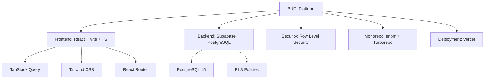

# BUDI Manifest

> The defining document of the BUDI School Management Platform.

---

## Identity

| Field | Value |
|-------|-------|
| **Name** | BUDI — Business & Unified Digital Information |
| **Tagline** | Modern school management, built for the future. |
| **Type** | Modular Multi-Tenant School Management Platform |
| **Version** | 0.1.0 (Foundation) |
| **License** | UNLICENSED (Private) |

## Architecture Philosophy

1. **Multi-Tenant by Design** — Every school is isolated via `school_id`. No shared data leakage.
2. **Feature-Based Modules** — Each domain (Finance, Academic, etc.) is a self-contained module with its own structure.
3. **AI-Ready** — Clear folder structures, READMEs, and cross-referenced documentation enable any AI to onboard instantly.
4. **Security at the Core** — Row Level Security (RLS) in PostgreSQL ensures tenant isolation at the database level.
5. **Scale from Day One** — Monorepo with shared packages, path aliases, and Turborepo caching.

## Technology Pillars



## Module Ecosystem

| Module | Code | Status | Description |
|--------|------|--------|-------------|
| Finance | `finance` | ✅ Active | Fee management, transactions, accounting |
| Academic | `academic` | ⚪ Placeholder | Curriculum, classes, grading |
| Library | `library` | ⚪ Placeholder | Book management, borrowing |
| Attendance | `attendance` | ⚪ Placeholder | Student attendance tracking |
| Inventory | `inventory` | ⚪ Placeholder | Asset & inventory management |
| Payroll | `payroll` | ⚪ Placeholder | Employee salary management |
| Student | `student` | ⚪ Placeholder | Student profile & records |
| Teacher | `teacher` | ⚪ Placeholder | Teacher profile & assignments |
| PPDB | `ppdb` | ⚪ Placeholder | Student admissions |

## Role System

```yaml
roles:
  super_admin:
    description: System-wide access
    scope: all_schools
  school_admin:
    description: School-level management
    scope: own_school
  treasurer:
    description: Finance operations
    scope: own_school
  viewer:
    description: Read-only access
    scope: own_school
```

## Directory Convention

```
src/
├── core/          # App-wide infrastructure
├── shared/        # Cross-module reusable code
└── modules/       # Feature modules
    └── finance/   # Feature slices
        ├── dashboard/
        ├── transactions/
        ├── categories/
        ├── accounts/
        ├── reports/
        └── settings/
```

## Commit Convention

We follow [Conventional Commits](https://www.conventionalcommits.org/):

```
feat(finance): add transaction list
fix(auth): resolve token refresh
docs(architecture): update RLS diagram
chore(deps): upgrade TanStack Query
```

## Related Documents

- [Code of Conduct](CONTRIBUTING.md)
- [Coding Standard](CODE_STYLE.md)
- [Architecture](docs/architecture.md)
- [Security](docs/security.md)

