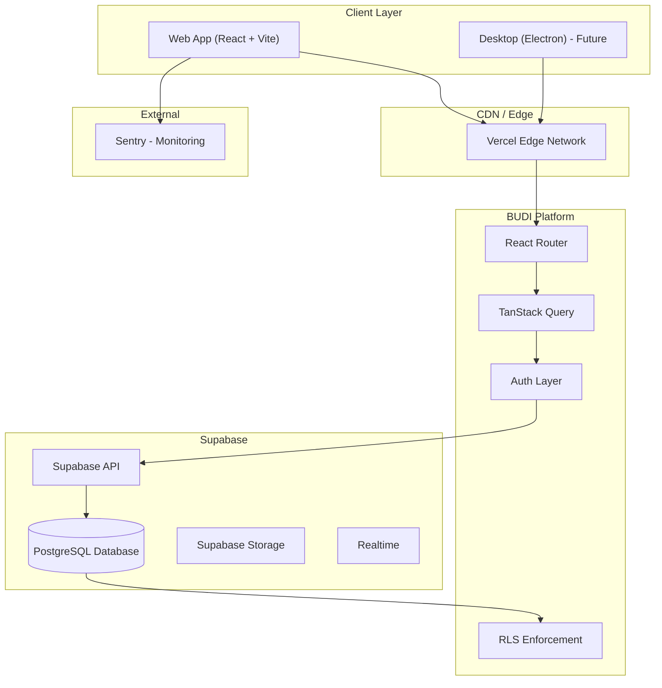
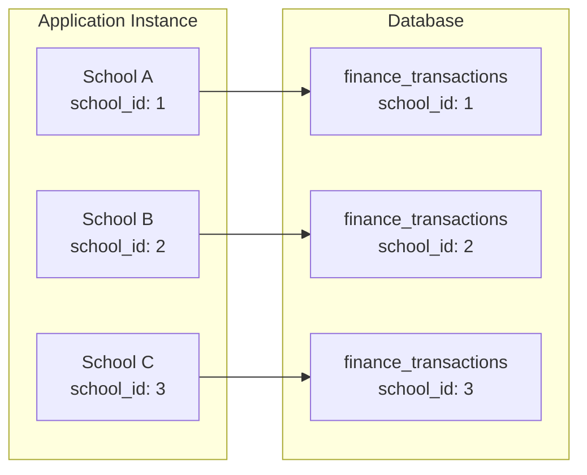
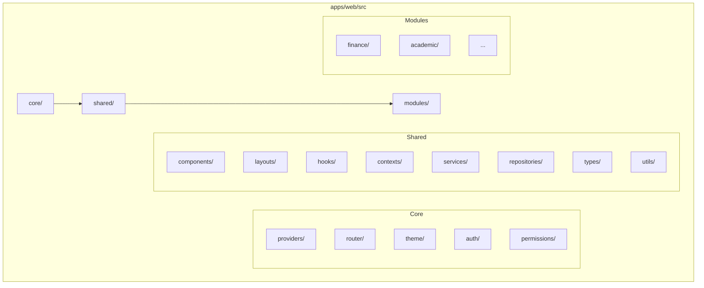
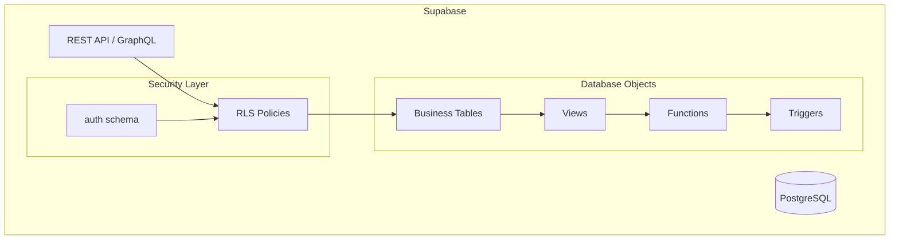
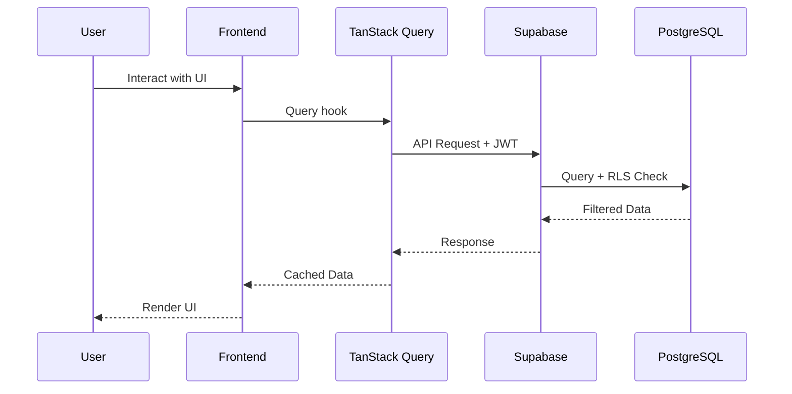

# Architecture — BUDI

> System architecture, design decisions, and component interactions.

---

## 📋 Table of Contents

1. [High-Level Architecture](#high-level-architecture)
2. [Multi-Tenant Design](#multi-tenant-design)
3. [Frontend Architecture](#frontend-architecture)
4. [Backend Architecture](#backend-architecture)
5. [Data Flow](#data-flow)
6. [Module Architecture](#module-architecture)
7. [Security Architecture](#security-architecture)

---

## High-Level Architecture



## Multi-Tenant Design



### Tenant Isolation Strategy

1. **`school_id`** column in every business table
2. **RLS Policies** enforce `school_id = auth.school_id()`
3. **API Layer** passes `school_id` from authenticated user context
4. **Frontend** never allows selecting a different school's data

## Frontend Architecture



### Core Layer

The `core/` layer provides application-wide infrastructure:

- **providers/** — React context providers (QueryClient, Theme, Auth)
- **router/** — Route definitions with lazy loading
- **theme/** — Theme tokens and Tailwind CSS configuration
- **auth/** — Authentication context and utilities
- **permissions/** — Role-based access control

### Shared Layer

The `shared/` layer contains reusable code used across modules:

- **components/** — UI primitives and shared components
- **hooks/** — Custom React hooks
- **services/** — API service layer (data fetching)
- **repositories/** — Data access layer (cache, persistence)

### Module Layer

Each module in `modules/` is a self-contained feature:

```
finance/
├── dashboard/     # Dashboard views
├── transactions/  # Transaction management
├── categories/    # Category management
├── accounts/      # Account management
├── reports/       # Reports and exports
└── settings/      # Module settings
```

## Backend Architecture



## Data Flow



## Module Architecture

### Active Module: Finance

```
modules/finance/
├── dashboard/       # Overview, charts, KPIs
├── transactions/    # Income/expense entries
├── categories/      # Transaction categories
├── accounts/        # Bank/cash accounts
├── reports/         # Financial statements
└── settings/        # Module configuration
```

### Placeholder Modules

Each future module follows the same pattern:

```
modules/<module>/
├── dashboard/
├── <feature>/
└── settings/
```

## Security Architecture

See [Security](security.md) for detailed security model.

**Key Principles:**

1. **Defense in depth** — RLS + API validation + UI restrictions
2. **Least privilege** — Each role has minimum required access
3. **Tenant isolation** — `school_id` enforced at every layer
4. **No BYO SQL** — All queries go through API/RLS

---

## Related Documents

- [Database Schema](database.md)
- [Folder Structure](folder-structure.md)
- [Security Model](security.md)
- [API Guidelines](api-guideline.md)

