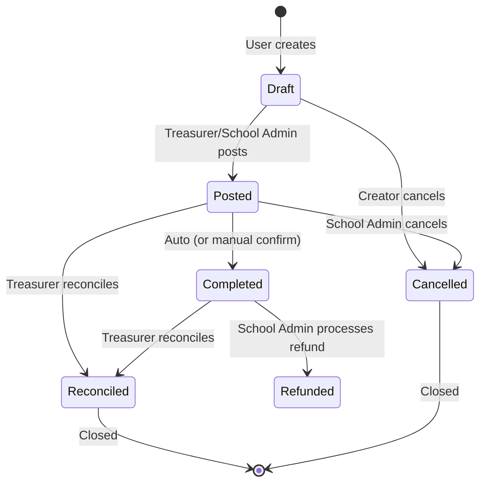
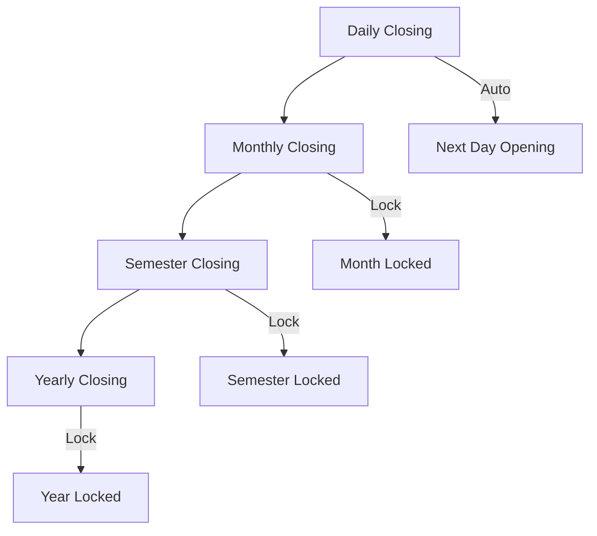
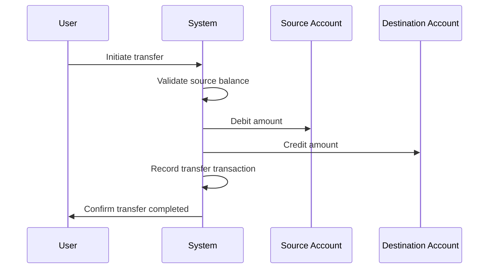
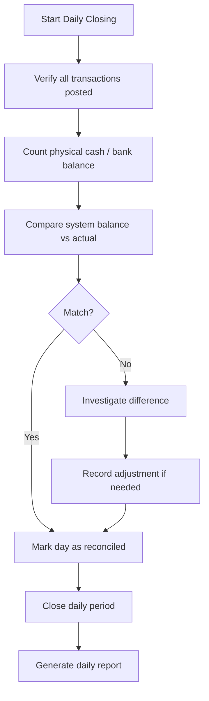
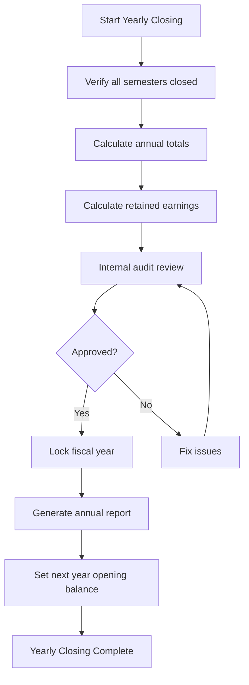
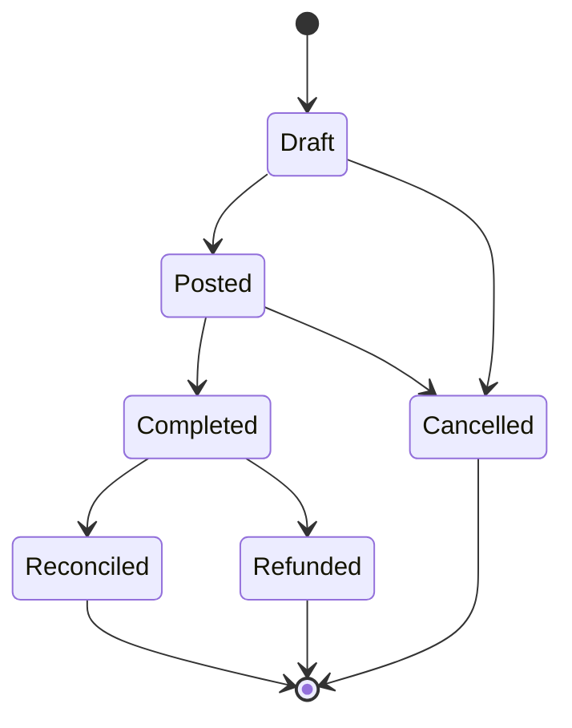

# BUDI Finance Module — Business Requirement Specification (BRS)

> **Document Version:** 1.0 **Status:** Draft for Review **Author:** BUDI Business Analysis Team
> **Date:** 2025-01-15 **Module:** Finance

---

## Document Control

| Version | Date       | Author       | Changes         |
| ------- | ---------- | ------------ | --------------- |
| 1.0     | 2025-01-15 | BUDI BA Team | Initial release |

## Approvals

| Role           | Name | Date | Signature |
| -------------- | ---- | ---- | --------- |
| Product Owner  | TBD  | —    | —         |
| Lead Architect | TBD  | —    | —         |
| QA Lead        | TBD  | —    | —         |

---

## Table of Contents

1. [Project Goal](#1-project-goal)
2. [Scope](#2-scope)
3. [Actors](#3-actors)
4. [Finance Workflow](#4-finance-workflow)
5. [Cash In](#5-cash-in)
6. [Cash Out](#6-cash-out)
7. [Transfer](#7-transfer)
8. [Opening Balance](#8-opening-balance)
9. [Closing Balance](#9-closing-balance)
10. [Daily Closing Process](#10-daily-closing-process)
11. [Monthly Closing](#11-monthly-closing)
12. [Semester Closing](#12-semester-closing)
13. [Yearly Closing](#13-yearly-closing)
14. [Transaction Status](#14-transaction-status)
15. [Editing Rules](#15-editing-rules)
16. [Delete Rules](#16-delete-rules)
17. [Audit Rules](#17-audit-rules)
18. [Receipt Number Rules](#18-receipt-number-rules)
19. [Reference Number Rules](#19-reference-number-rules)
20. [Report Rules](#20-report-rules)
21. [Import Excel Rules](#21-import-excel-rules)
22. [Export Excel Rules](#22-export-excel-rules)
23. [Attachment Rules](#23-attachment-rules)
24. [School Isolation Rules](#24-school-isolation-rules)
25. [Security Rules](#25-security-rules)
26. [Validation Rules](#26-validation-rules)
27. [Error Handling Rules](#27-error-handling-rules)
28. [Future Expansion Rules](#28-future-expansion-rules)
29. [Business Glossary](#29-business-glossary)
30. [Functional Requirements](#30-functional-requirements)
31. [Non-Functional Requirements](#31-non-functional-requirements)
32. [Acceptance Criteria](#32-acceptance-criteria)

---

## 1. Project Goal

### 1.1 Vision Statement

To build a **unified, multi-tenant digital finance management system** that enables schools to
manage all financial operations — including income, expenses, transfers, reconciliations, and
reporting — in a secure, scalable, and auditable manner.

### 1.2 Business Objectives

| #      | Objective                                           | Success Metric                                 |
| ------ | --------------------------------------------------- | ---------------------------------------------- |
| OBJ-01 | Eliminate manual bookkeeping errors                 | 100% accurate transaction recording            |
| OBJ-02 | Provide real-time financial visibility              | Dashboard loads < 2 seconds                    |
| OBJ-03 | Ensure complete audit trail                         | Every transaction traced to user and timestamp |
| OBJ-04 | Support multi-school isolation                      | No data leakage between schools                |
| OBJ-05 | Enable daily, monthly, semester, and yearly closing | Reports generated automatically                |
| OBJ-06 | Reduce reconciliation effort by 80%                 | Automated difference detection                 |

### 1.3 Problem Statement

Schools currently manage finances using fragmented tools (spreadsheets, paper ledgers, disconnected
software). This leads to:

- **Data silos** — No single source of truth
- **Manual errors** — Human mistakes in data entry and calculation
- **Audit difficulty** — No traceability of changes
- **Reporting delays** — Financial reports take days to compile
- **Multi-school complexity** — No unified platform for school groups

---

## 2. Scope

### 2.1 In-Scope

The Finance module covers the following capabilities:

| Area                        | Covered |
| --------------------------- | ------- |
| Cash In (Income)            | ✅ Full |
| Cash Out (Expense)          | ✅ Full |
| Transfer between accounts   | ✅ Full |
| Opening Balance             | ✅ Full |
| Closing Balance             | ✅ Full |
| Daily Closing Process       | ✅ Full |
| Monthly Closing             | ✅ Full |
| Semester Closing            | ✅ Full |
| Yearly Closing              | ✅ Full |
| Transaction Categories      | ✅ Full |
| Account Management          | ✅ Full |
| Cash Register Management    | ✅ Full |
| Receipt Number Management   | ✅ Full |
| Reference Number Management | ✅ Full |
| Attachment Management       | ✅ Full |
| Report Generation           | ✅ Full |
| Import from Excel           | ✅ Full |
| Export to Excel             | ✅ Full |
| Audit Trail                 | ✅ Full |
| Multi-Tenant Isolation      | ✅ Full |
| Role-Based Access Control   | ✅ Full |

### 2.2 Out-of-Scope (Future Phases)

| Area                            | Planned Phase                |
| ------------------------------- | ---------------------------- |
| Invoice generation & sending    | v0.4.0                       |
| Payment gateway integration     | v0.5.0                       |
| Budget planning & tracking      | v0.6.0                       |
| Tax calculation & reporting     | v0.7.0                       |
| Student fee module              | Combined with Student module |
| Payroll integration             | Combined with Payroll module |
| Automated bank reconciliation   | v1.0.0                       |
| Multi-currency advanced support | v1.1.0                       |
| AI-powered anomaly detection    | v2.0.0                       |

### 2.3 Modules NOT Covered

The following modules are **outside the current Finance scope**:

- Academic
- Attendance
- Library
- Inventory
- Payroll
- Student
- Teacher
- PPDB

---

## 3. Actors

### 3.1 Actor Overview

| Actor        | System Role    | Scope                     | Level |
| ------------ | -------------- | ------------------------- | ----- |
| Super Admin  | `super_admin`  | All schools               | 100   |
| School Admin | `school_admin` | Own school                | 80    |
| Treasurer    | `treasurer`    | Own school (Finance only) | 60    |
| Viewer       | `viewer`       | Own school (Read-only)    | 20    |

### 3.2 Super Admin

**Description:** System-wide administrator with access to all schools.

**Responsibilities:**

- Create and manage schools
- Manage all users across schools
- Access any school's financial data
- Configure system settings
- Perform system-level audits
- Override any transaction (with audit trail)

**Finance Permissions:**

- Full CRUD on all finance data across all schools
- Can view, create, edit, delete, and reconcile any transaction
- Can generate reports for any school
- Can export data from any school

**Constraints:**

- All actions are audited
- Cannot modify audit logs
- Delete is always soft-delete

### 3.3 School Admin

**Description:** School-level administrator for a single school.

**Responsibilities:**

- Manage users within their school
- Configure school settings
- Oversee all financial operations
- Manage accounts and categories
- Generate reports

**Finance Permissions:**

- Full CRUD on finance data within their school
- Manage accounts and categories
- Manage cash registers
- Approve/cancel transactions
- Generate all reports
- Export data

**Constraints:**

- Cannot access other schools' data
- Cannot delete system accounts or categories
- Cannot modify reconciled transactions
- All actions are audited

### 3.4 Treasurer

**Description:** Finance operator focused on daily financial transactions.

**Responsibilities:**

- Record cash in and cash out transactions
- Manage daily cash operations
- Perform bank transfers
- Reconcile transactions
- Attach receipts and supporting documents
- Generate basic reports

**Finance Permissions:**

- Create and edit transactions (pending/completed)
- Manage cash registers (open/close)
- Attach files to transactions
- View reports
- Export data

**Constraints:**

- Cannot create or edit accounts
- Cannot create or edit transaction categories
- Cannot delete transactions
- Cannot modify posted transactions
- Cannot cancel transactions (request only)
- Cannot access other schools' data

### 3.5 Viewer

**Description:** Read-only user for financial oversight.

**Responsibilities:**

- View financial data
- View reports
- Monitor financial health

**Finance Permissions:**

- View all finance data (read-only)
- View reports
- Export data

**Constraints:**

- Cannot create, edit, or delete any data
- Cannot reconcile transactions
- Cannot manage accounts or categories
- Cannot open or close cash registers
- Cannot access other schools' data

### 3.6 Actor Permissions Matrix

| Feature                  | Super Admin | School Admin | Treasurer | Viewer |
| ------------------------ | :---------: | :----------: | :-------: | :----: |
| View transactions        |     ✅      |      ✅      |    ✅     |   ✅   |
| Create transactions      |     ✅      |      ✅      |    ✅     |   ❌   |
| Edit draft transactions  |     ✅      |      ✅      |    ✅     |   ❌   |
| Edit posted transactions |     ✅      |      ✅      |    ❌     |   ❌   |
| Cancel transactions      |     ✅      |      ✅      |    ❌     |   ❌   |
| Delete transactions      |     ✅      |      ✅      |    ❌     |   ❌   |
| Manage accounts          |     ✅      |      ✅      |    ❌     |   ❌   |
| Manage categories        |     ✅      |      ✅      |    ❌     |   ❌   |
| Open cash register       |     ✅      |      ✅      |    ✅     |   ❌   |
| Close cash register      |     ✅      |      ✅      |    ✅     |   ❌   |
| Reconcile                |     ✅      |      ✅      |    ✅     |   ❌   |
| Generate reports         |     ✅      |      ✅      |    ✅     |   ✅   |
| Export data              |     ✅      |      ✅      |    ✅     |   ✅   |
| View audit logs          |     ✅      |      ✅      |    ❌     |   ❌   |
| Manage settings          |     ✅      |      ✅      |    ❌     |   ❌   |
| Cross-school access      |     ✅      |      ❌      |    ❌     |   ❌   |

---

## 4. Finance Workflow

### 4.1 Core Transaction Lifecycle



### 4.2 Transaction States

| State          | Description                                                     | Visibility           |
| -------------- | --------------------------------------------------------------- | -------------------- |
| **Draft**      | Initial state. Transaction is not yet finalized. Can be edited. | Creator and admins   |
| **Posted**     | Transaction is posted to the ledger. Edits are restricted.      | All authorized users |
| **Completed**  | Transaction is fully executed (e.g., cash received/paid).       | All authorized users |
| **Reconciled** | Transaction matches bank/cash statement. Final state.           | All authorized users |
| **Cancelled**  | Transaction voided before completion.                           | All authorized users |
| **Refunded**   | Previously completed transaction refunded.                      | All authorized users |

### 4.3 Account Balance Lifecycle


### 4.4 Financial Period Closure



---

## 5. Cash In

### 5.1 Definition

**Cash In** represents any transaction that increases the balance of a school's financial account.
Also referred to as **income**, **receipt**, or **inflow**.

### 5.2 Business Rules

| Rule ID | Description                                                                         |
| ------- | ----------------------------------------------------------------------------------- |
| CI-01   | Cash In transactions MUST have a positive amount                                    |
| CI-02   | Cash In MUST be classified under an income category                                 |
| CI-03   | Cash In MUST be assigned to an active account                                       |
| CI-04   | Cash In MUST have a transaction date (cannot be future-dated beyond current period) |
| CI-05   | Cash In can optionally have a receipt number                                        |
| CI-06   | Cash In can optionally have a reference number                                      |
| CI-07   | Cash In can optionally have attachments                                             |
| CI-08   | Cash In increases the account's current_balance                                     |
| CI-09   | Cash In TYPE is `cash_in`                                                           |

### 5.3 Cash In Sources

| Source           | Description                     | Example             |
| ---------------- | ------------------------------- | ------------------- |
| Student Tuition  | Fee payments from students      | SPP payment         |
| Registration Fee | New student registration        | PPDB fee            |
| Donation         | External donations              | Alumni donation     |
| Grant            | Government/Institutional grants | BOS funds           |
| Other Income     | Miscellaneous income            | Book sales, canteen |

### 5.4 Cash In Validation

- Amount MUST be > 0
- Category MUST be `income` type
- Account MUST be active and belong to the same school
- Transaction date MUST be within an open period
- Duplicate receipt numbers are NOT allowed per school

---

## 6. Cash Out

### 6.1 Definition

**Cash Out** represents any transaction that decreases the balance of a school's financial account.
Also referred to as **expense**, **payment**, or **outflow**.

### 6.2 Business Rules

| Rule ID | Description                                                                           |
| ------- | ------------------------------------------------------------------------------------- |
| CO-01   | Cash Out transactions MUST have a positive amount                                     |
| CO-02   | Cash Out MUST be classified under an expense category                                 |
| CO-03   | Cash Out MUST be assigned to an active account                                        |
| CO-04   | Cash Out MUST have sufficient balance in the account (unless overdraft is configured) |
| CO-05   | Cash Out MUST have a transaction date                                                 |
| CO-06   | Cash Out can optionally have a reference number (e.g., PO number)                     |
| CO-07   | Cash Out can optionally have attachments (e.g., invoice, receipt)                     |
| CO-08   | Cash Out decreases the account's current_balance                                      |
| CO-09   | Cash Out TYPE is `cash_out`                                                           |

### 6.3 Cash Out Categories

| Category      | Description                        | Example                      |
| ------------- | ---------------------------------- | ---------------------------- |
| Operational   | Day-to-day school operations       | Electricity, water, internet |
| Salary        | Employee salary payments           | Teacher salaries             |
| Maintenance   | Building and equipment maintenance | AC repair                    |
| Supplies      | Office and educational supplies    | Stationery, lab equipment    |
| Utilities     | Utility bills                      | Electricity, water, phone    |
| Activities    | School events and activities       | Field trip, sports day       |
| Other Expense | Miscellaneous expenses             | Transportation               |

### 6.4 Cash Out Validation

- Amount MUST be > 0
- Category MUST be `expense` type
- Account balance MUST be >= transaction amount (configurable)
- Account MUST be active and belong to the same school
- Cannot exceed configured expense limit (if any)
- Duplicate reference numbers SHOULD warn user

---

## 7. Transfer

### 7.1 Definition

**Transfer** represents moving funds between two accounts within the same school. This does not
change the school's total balance — only redistributes it.

### 7.2 Business Rules

| Rule ID | Description                                                            |
| ------- | ---------------------------------------------------------------------- |
| TR-01   | Transfer MUST have a source account and a destination account          |
| TR-02   | Source and destination MUST be different accounts                      |
| TR-03   | Both accounts MUST belong to the same school                           |
| TR-04   | Source account MUST have sufficient balance                            |
| TR-05   | Transfer amount MUST be > 0                                            |
| TR-06   | Transfer TYPE is `transfer`                                            |
| TR-07   | Transfer creates TWO entries: debit from source, credit to destination |
| TR-08   | Transfer MUST have a reference number for traceability                 |
| TR-09   | Transfer fee (if any) MUST be recorded separately                      |

### 7.3 Transfer Flow



### 7.4 Transfer Validation

- Source account MUST have sufficient balance
- Transfer amount MUST be > 0
- Both accounts MUST be active
- Both accounts MUST belong to the same school
- Transfer fee (if applicable) MUST be recorded as a separate cash_out transaction
- Transfer requires Treasurer or higher role

---

## 8. Opening Balance

### 8.1 Definition

**Opening Balance** is the balance of an account at the start of a financial period (day, month,
semester, year).

### 8.2 Business Rules

| Rule ID | Description                                                    |
| ------- | -------------------------------------------------------------- |
| OB-01   | Opening Balance is set when an account is created              |
| OB-02   | Opening Balance can be adjusted only by School Admin or higher |
| OB-03   | Daily Opening Balance = Previous day's Closing Balance         |
| OB-04   | Monthly Opening Balance = First day of month's Opening Balance |
| OB-05   | Yearly Opening Balance = First day of year's Opening Balance   |
| OB-06   | Opening Balance adjustment MUST have an audit trail            |
| OB-07   | Opening Balance adjustment requires reason/notes               |

### 8.3 Opening Balance Calculation

```sql
-- Daily Opening Balance
Opening Balance = PREVIOUS_DAY_CLOSING_BALANCE

-- Monthly Opening Balance
Opening Balance = BALANCE_AT_MONTH_START

-- Yearly Opening Balance
Opening Balance = BALANCE_AT_YEAR_START
```

### 8.4 Opening Balance Adjustment Rules

- Only School Admin and Super Admin can adjust opening balance
- Adjustment MUST include a reason/description
- Adjustment triggers an audit log entry
- Adjustment cannot exceed configured limits
- Adjustment is NOT allowed after yearly closing

---

## 9. Closing Balance

### 9.1 Definition

**Closing Balance** is the balance of an account at the end of a financial period after all
transactions have been processed.

### 9.2 Business Rules

| Rule ID | Description                                                           |
| ------- | --------------------------------------------------------------------- |
| CB-01   | Closing Balance = Opening Balance + Total Cash In - Total Cash Out    |
| CB-02   | Closing Balance is calculated automatically by the system             |
| CB-03   | Closing Balance can differ from expected balance (difference tracked) |
| CB-04   | Difference MUST be investigated and resolved before period closure    |
| CB-05   | Closing Balance becomes the next period's Opening Balance             |

### 9.3 Closing Balance Formula

```sql
Closing Balance = Opening Balance
                + SUM(Cash In Amount)
                - SUM(Cash Out Amount)
                + SUM(Transfer In Amount)
                - SUM(Transfer Out Amount)
```

---

## 10. Daily Closing Process

### 10.1 Purpose

Daily Closing ensures that all transactions for a given day are accounted for and the cash position
is verified.

### 10.2 Process Flow



### 10.3 Business Rules

| Rule ID | Description                                                            |
| ------- | ---------------------------------------------------------------------- |
| DC-01   | Daily Closing is performed per account                                 |
| DC-02   | Daily Closing MUST be performed by Treasurer or higher                 |
| DC-03   | All transactions for the day MUST be in 'posted' or 'completed' status |
| DC-04   | No new transactions can be added to a closed day                       |
| DC-05   | Difference between system and actual MUST be recorded                  |
| DC-06   | Daily Closing generates a Daily Cash Report                            |
| DC-07   | A day can be reopened only by School Admin or higher                   |
| DC-08   | Daily Closing is mandatory before Monthly Closing                      |

### 10.4 Daily Cash Report Content

| Field             | Description                      |
| ----------------- | -------------------------------- |
| School Name       | Name of the school               |
| Account           | Account name                     |
| Date              | Closing date                     |
| Opening Balance   | Balance at start of day          |
| Total Cash In     | Sum of all cash_in transactions  |
| Total Cash Out    | Sum of all cash_out transactions |
| Closing Balance   | Calculated closing balance       |
| Actual Balance    | Physical count / bank statement  |
| Difference        | Variance                         |
| Transaction Count | Number of transactions           |
| Closed By         | User who performed closing       |

---

## 11. Monthly Closing

### 11.1 Purpose

Monthly Closing finalizes all financial activities for a calendar month and generates comprehensive
monthly reports.

### 11.2 Business Rules

| Rule ID | Description                                                               |
| ------- | ------------------------------------------------------------------------- |
| MC-01   | Monthly Closing is performed per school                                   |
| MC-02   | Monthly Closing MUST be performed by School Admin or higher               |
| MC-03   | All days in the month MUST be closed before Monthly Closing               |
| MC-04   | Monthly Closing locks all transactions for that month                     |
| MC-05   | After closing, edits require special override (audited)                   |
| MC-06   | Monthly Closing generates a Monthly Financial Report                      |
| MC-07   | Monthly report includes: income, expense, net balance, category breakdown |
| MC-08   | Monthly report is stored in `monthly_reports` table for fast access       |

### 11.3 Monthly Report Content

| Field              | Description                         |
| ------------------ | ----------------------------------- |
| School             | School name                         |
| Period             | Month and Year                      |
| Total Income       | Sum of all income for the month     |
| Total Expense      | Sum of all expense for the month    |
| Net Balance        | Income - Expense                    |
| Opening Balance    | Balance at month start              |
| Closing Balance    | Balance at month end                |
| Category Breakdown | Per-category income/expense summary |
| Account Breakdown  | Per-account balance summary         |
| Transaction Count  | Total transactions in the month     |
| Generated At       | Timestamp of report generation      |

### 11.4 Monthly Closing Validation

- All daily closings completed
- No pending (draft) transactions
- All difference investigations resolved
- Treasurer confirmation received
- School Admin approval received

---

## 12. Semester Closing

### 12.1 Purpose

Semester Closing summarizes financial performance over an academic semester (typically 6 months).

### 12.2 Business Rules

| Rule ID | Description                                                  |
| ------- | ------------------------------------------------------------ |
| SC-01   | Semester Closing is performed per school                     |
| SC-02   | Semester is defined by school's academic calendar            |
| SC-03   | Semesters: Semester 1 (Jul-Dec) and Semester 2 (Jan-Jun)     |
| SC-04   | All months in the semester MUST be closed                    |
| SC-05   | Semester Closing MUST be performed by School Admin or higher |
| SC-06   | Semester report includes aggregated monthly data             |

### 12.3 Semester Report Content

| Field              | Description          |
| ------------------ | -------------------- |
| School             | School name          |
| Academic Year      | e.g., 2024/2025      |
| Semester           | 1 or 2               |
| Total Income       | Sum of all income    |
| Total Expense      | Sum of all expense   |
| Net Balance        | Income - Expense     |
| Monthly Breakdown  | Per-month summary    |
| Category Breakdown | Per-category summary |
| Account Breakdown  | Per-account summary  |

---

## 13. Yearly Closing

### 13.1 Purpose

Yearly Closing finalizes the entire fiscal year. All accounts are closed, and the year's financial
performance is locked.

### 13.2 Business Rules

| Rule ID | Description                                                         |
| ------- | ------------------------------------------------------------------- |
| YC-01   | Yearly Closing is performed per school                              |
| YC-02   | Yearly Closing MUST be performed by School Admin or higher          |
| YC-03   | All semesters in the year MUST be closed                            |
| YC-04   | Yearly Closing locks ALL transactions for the year                  |
| YC-05   | After closing, year CANNOT be reopened without Super Admin approval |
| YC-06   | Year-end closing balance becomes next year's opening balance        |
| YC-07   | Yearly Closing generates annual financial statements                |
| YC-08   | Retained earnings are calculated during yearly closing              |

### 13.3 Year-End Process



### 13.4 Yearly Report Content

| Field              | Description                   |
| ------------------ | ----------------------------- |
| School             | School name                   |
| Year               | Fiscal year                   |
| Total Income       | Annual income                 |
| Total Expense      | Annual expense                |
| Net Balance        | Annual net                    |
| Monthly Breakdown  | Per-month income/expense      |
| Category Breakdown | Annual category summary       |
| Account Breakdown  | Annual account summary        |
| Retained Earnings  | Profit retained for next year |
| Audit Notes        | Any audit findings            |

---

## 14. Transaction Status

### 14.1 Status Definitions

| Status     | Code         | Description                           | Can Edit? | Can Delete? |
| ---------- | ------------ | ------------------------------------- | :-------: | :---------: |
| Draft      | `draft`      | Initial state, not yet posted         |    ✅     |     ✅      |
| Posted     | `posted`     | Recorded in ledger, pending execution |   ❌\*    |     ❌      |
| Completed  | `completed`  | Fully executed                        |    ❌     |     ❌      |
| Reconciled | `reconciled` | Matched with bank/cash statement      |    ❌     |     ❌      |
| Cancelled  | `cancelled`  | Voided before completion              |    ❌     |     ❌      |
| Refunded   | `refunded`   | Money returned to payer               |    ❌     |     ❌      |

_\*Posted transactions can be edited only by School Admin or higher, with audit trail._

### 14.2 Status Transitions



### 14.3 Rules Per Status

**Draft:**

- User can edit all fields
- User can delete the transaction
- Draft transactions do NOT affect account balances
- Draft transactions are NOT included in reports

**Posted:**

- Transaction affects account balance
- Only Treasurer/School Admin can edit
- Edits are restricted to: description, notes, attachments
- Cannot change: amount, account, category, date
- Cannot be deleted (only cancelled)

**Completed:**

- Final execution confirmed
- No edits allowed
- Can be reconciled or refunded

**Reconciled:**

- Final state — no further changes
- Matched with external statement

**Cancelled:**

- Transaction is voided
- If balance was affected, reversal MUST be recorded
- Reason for cancellation MUST be provided
- Cannot be uncancelled

**Refunded:**

- Applies only to completed Cash In transactions
- Refund MUST reference the original transaction
- Refund records a corresponding Cash Out
- Cannot be refunded if already reconciled

---

## 15. Editing Rules

### 15.1 General Editing Rules

| Rule ID | Description                                               |
| ------- | --------------------------------------------------------- |
| ED-01   | Only users with edit permission can edit transactions     |
| ED-02   | All edits MUST be audited (before/after values)           |
| ED-03   | Edits that change amount MUST recalculate account balance |
| ED-04   | Edits cannot change `school_id`                           |
| ED-05   | Edits cannot change `created_by`                          |
| ED-06   | Edits cannot change `created_at`                          |

### 15.2 Editable Fields by Transaction Status

| Field            | Draft | Posted | Completed | Reconciled |
| ---------------- | :---: | :----: | :-------: | :--------: |
| Amount           |  ✅   |   ❌   |    ❌     |     ❌     |
| Account          |  ✅   |   ❌   |    ❌     |     ❌     |
| Category         |  ✅   |   ❌   |    ❌     |     ❌     |
| Date             |  ✅   |   ❌   |    ❌     |     ❌     |
| Type             |  ✅   |   ❌   |    ❌     |     ❌     |
| Description      |  ✅   |   ✅   |    ❌     |     ❌     |
| Notes            |  ✅   |   ✅   |    ❌     |     ❌     |
| Attachments      |  ✅   |   ✅   |    ✅     |     ❌     |
| Receipt Number   |  ✅   |   ✅   |    ❌     |     ❌     |
| Reference Number |  ✅   |   ✅   |    ❌     |     ❌     |

### 15.3 Edit Restrictions

- Amount cannot be reduced below 0 (must create reversal instead)
- Account can only be changed if balance permits
- Date cannot be moved to a closed period
- Category change must respect income/expense type
- Never edit reconciled transactions — create adjustment instead

---

## 16. Delete Rules

### 16.1 General Delete Rules

| Rule ID | Description                                                    |
| ------- | -------------------------------------------------------------- |
| DL-01   | Only Draft transactions can be deleted                         |
| DL-02   | After posting, transactions CANNOT be deleted — only cancelled |
| DL-03   | Deleting a Draft is a permanent action (not recoverable)       |
| DL-04   | Deleting a Draft does NOT affect account balances              |
| DL-05   | Deleting a Draft does NOT affect report calculations           |
| DL-06   | Delete MUST confirm with user: "Are you sure?"                 |
| DL-07   | Delete is logged in audit trail                                |

### 16.2 Soft Delete vs Hard Delete

| Aspect         | Draft (Hard Delete) | Posted+ (Soft Delete)                   |
| -------------- | ------------------- | --------------------------------------- |
| Method         | Physical delete     | Set `deleted_at`                        |
| Recoverable    | No                  | Yes (by admin)                          |
| Balance impact | None                | Handled via cancellation                |
| Report impact  | None                | Excluded via `WHERE deleted_at IS NULL` |
| Audit logged   | ✅                  | ✅                                      |

### 16.3 Cascade Delete Rules

| Action                   | Effect                                          |
| ------------------------ | ----------------------------------------------- |
| Delete Draft transaction | Cascade delete transaction_items                |
| Delete Draft transaction | Detach attachments (set transaction_id to NULL) |
| Delete account           | Prevented if account has transactions           |
| Delete category          | Prevented if category has transactions          |
| Delete school            | Cascade soft-delete all related records         |

---

## 17. Audit Rules

### 17.1 What Gets Audited

Every significant action is recorded in `audit_logs`:

| Action                     | Fields Recorded                       |
| -------------------------- | ------------------------------------- |
| Transaction Created        | All initial values                    |
| Transaction Edited         | Before/after values of changed fields |
| Transaction Deleted        | Entire record before deletion         |
| Transaction Status Changed | Old status → New status               |
| Account Created/Edited     | All relevant fields                   |
| Category Created/Edited    | All relevant fields                   |
| Cash Register Opened       | Opening balance, account              |
| Cash Register Closed       | Closing balance, difference           |
| Daily Closing              | All closing data                      |
| Report Generated           | Report type, period                   |
| Data Export                | What was exported, by whom            |
| Login/Logout               | Timestamp, IP address                 |
| Permission Change          | User, old role, new role              |

### 17.2 Audit Log Structure

| Field         | Description                                    |
| ------------- | ---------------------------------------------- |
| `id`          | Unique audit entry ID                          |
| `school_id`   | School context (nullable for system actions)   |
| `user_id`     | Who performed the action                       |
| `action`      | Action type (create, update, delete, etc.)     |
| `entity_type` | What was affected (transaction, account, etc.) |
| `entity_id`   | ID of the affected entity                      |
| `changes`     | JSONB — before and after values                |
| `ip_address`  | User's IP address                              |
| `user_agent`  | Browser/device information                     |
| `metadata`    | Additional context                             |
| `created_at`  | When the action occurred                       |

### 17.3 Audit Rules

| Rule ID | Description                                                          |
| ------- | -------------------------------------------------------------------- |
| AU-01   | Audit logs are APPEND-ONLY — never updated or deleted                |
| AU-02   | Audit logs are immutable — no UPDATE or DELETE policies              |
| AU-03   | Audit logs are readable by School Admin and Super Admin              |
| AU-04   | Audit logs are retained indefinitely (no auto-deletion)              |
| AU-05   | Audit logs include IP address for traceability                       |
| AU-06   | Audit logs capture before AND after values for edits                 |
| AU-07   | Audit logs are searchable by: date range, user, action, entity       |
| AU-08   | Failed actions are also logged (invalid attempts, permission errors) |

### 17.4 Audit Retention

| Data              | Retention Period | Action After            |
| ----------------- | ---------------- | ----------------------- |
| Transaction audit | Indefinite       | Keep forever            |
| Login audit       | 1 year           | Archive to cold storage |
| Export audit      | 1 year           | Archive to cold storage |
| Report generation | 1 year           | Archive to cold storage |

---

## 18. Receipt Number Rules

### 18.1 Definition

A **Receipt Number** is a unique identifier assigned to Cash In transactions for tracking payment
receipts.

### 18.2 Receipt Number Format

```
RCP-{YYYYMMDD}-{SEQUENCE}
```

**Example:** `RCP-20250115-001`

| Segment    | Description                                |
| ---------- | ------------------------------------------ |
| `RCP`      | Prefix indicating Receipt                  |
| `YYYYMMDD` | Date of transaction                        |
| `SEQUENCE` | Daily sequential number (001, 002, 003...) |

### 18.3 Business Rules

| Rule ID | Description                                                     |
| ------- | --------------------------------------------------------------- |
| RN-01   | Receipt numbers are auto-generated for Cash In transactions     |
| RN-02   | Receipt numbers CAN be manually overridden                      |
| RN-03   | Receipt numbers MUST be unique per school                       |
| RN-04   | The sequence resets daily                                       |
| RN-05   | Receipt number format is configurable per school                |
| RN-06   | Receipt numbers cannot be changed after a transaction is posted |
| RN-07   | Cancelled transactions keep their receipt number (not reused)   |

### 18.4 Receipt Number Configuration

| Setting         | Default    | Description                        |
| --------------- | ---------- | ---------------------------------- |
| Prefix          | `RCP`      | Configurable prefix                |
| Include date    | Yes        | Toggle date inclusion              |
| Date format     | `YYYYMMDD` | Configurable format                |
| Sequence length | 3          | Number of digits (001, 0001, etc.) |
| Auto-generate   | Yes        | Toggle auto-generation             |
| Allow manual    | Yes        | Toggle manual override             |

---

## 19. Reference Number Rules

### 19.1 Definition

A **Reference Number** is an external identifier used to link transactions to external documents
(e.g., PO number, invoice number, bank reference).

### 19.2 Business Rules

| Rule ID | Description                                                        |
| ------- | ------------------------------------------------------------------ |
| RF-01   | Reference numbers are optional                                     |
| RF-02   | Reference numbers can be alphanumeric (max 100 chars)              |
| RF-03   | Reference numbers are user-entered (not auto-generated)            |
| RF-04   | Reference numbers should have a label indicating the source        |
| RF-05   | Reference numbers are searchable                                   |
| RF-06   | Reference numbers can be used to link related transactions         |
| RF-07   | Reference numbers are NOT required to be unique                    |
| RF-08   | System SHOULD warn if same reference number is used multiple times |

### 19.3 Reference Number Types

| Type           | Label           | Example         |
| -------------- | --------------- | --------------- |
| Purchase Order | PO Number       | PO-2025-001     |
| Invoice        | Invoice Number  | INV-2025-001    |
| Bank Reference | Bank Ref        | BTRF20250115001 |
| Contract       | Contract Number | CTR-2025-001    |
| Custom         | Custom Label    | User-defined    |

---

## 20. Report Rules

### 20.1 Report Types

| Report                     | Frequency    | Created By   | Access    |
| -------------------------- | ------------ | ------------ | --------- |
| Daily Cash Report          | Daily        | System auto  | All roles |
| Monthly Financial Report   | Monthly      | System auto  | All roles |
| Semester Report            | Per semester | System auto  | All roles |
| Yearly Financial Statement | Yearly       | System auto  | All roles |
| Transaction List           | On demand    | User request | All roles |
| Category Summary           | On demand    | User request | All roles |
| Account Summary            | On demand    | User request | All roles |
| Custom Date Range          | On demand    | User request | All roles |

### 20.2 Report Rules

| Rule ID | Description                                                            |
| ------- | ---------------------------------------------------------------------- |
| RP-01   | Reports are generated based on the school's timezone                   |
| RP-02   | Reports include only non-deleted transactions                          |
| RP-03   | Reports exclude cancelled transactions (unless specifically requested) |
| RP-04   | Reports respect role-based data visibility                             |
| RP-05   | School-scoped reports only show that school's data                     |
| RP-06   | Pre-computed reports are cached in report tables                       |
| RP-07   | On-demand reports are generated in real-time                           |
| RP-08   | Reports can be exported to Excel and PDF                               |
| RP-09   | Report generation is logged in audit trail                             |
| RP-10   | Reports show school name, period, and generation timestamp             |

### 20.3 Report Filters

| Filter     | Description                                   |
| ---------- | --------------------------------------------- |
| Date Range | Start date — End date                         |
| Account    | Filter by specific account                    |
| Category   | Filter by specific category                   |
| Type       | Income / Expense / Transfer / All             |
| Status     | Draft / Posted / Completed / Reconciled / All |
| Created By | Filter by user who created the transaction    |

---

## 21. Import Excel Rules

### 21.1 Purpose

Allow users to import financial data from Excel spreadsheets for bulk data entry or migration.

### 21.2 Business Rules

| Rule ID | Description                                            |
| ------- | ------------------------------------------------------ |
| IM-01   | Import is available to Treasurer and higher roles      |
| IM-02   | Import supports .xlsx and .csv formats                 |
| IM-03   | Import template MUST be downloaded from the system     |
| IM-04   | Import template MUST include required columns          |
| IM-05   | System MUST validate all rows before importing         |
| IM-06   | Valid rows are imported; invalid rows are reported     |
| IM-07   | Import transaction is atomic — all or nothing          |
| IM-08   | Import creates transactions in 'Draft' status          |
| IM-09   | Import log shows: total rows, imported, failed, errors |
| IM-10   | Maximum import rows: 5,000 per file                    |
| IM-11   | Maximum file size: 10 MB                               |

### 21.3 Import Template Structure

| Column           | Required | Type   | Description                   |
| ---------------- | :------: | ------ | ----------------------------- |
| Transaction Date |    ✅    | Date   | Date of transaction           |
| Type             |    ✅    | Text   | cash_in / cash_out / transfer |
| Account Code     |    ✅    | Text   | Account code in the system    |
| Category Name    |    ✅    | Text   | Category name in the system   |
| Amount           |    ✅    | Number | Transaction amount (> 0)      |
| Description      |    ✅    | Text   | Transaction description       |
| Notes            |    ❌    | Text   | Additional notes              |
| Receipt Number   |    ❌    | Text   | Optional receipt number       |
| Reference Number |    ❌    | Text   | Optional reference number     |
| Payment Method   |    ❌    | Text   | Payment method code           |

### 21.4 Import Validation

| Validation                   | Error Message                                 |
| ---------------------------- | --------------------------------------------- |
| Required field missing       | "Column [name] is required"                   |
| Invalid date format          | "Invalid date format in row X"                |
| Invalid type                 | "Type must be cash_in, cash_out, or transfer" |
| Account not found            | "Account [code] not found"                    |
| Category not found           | "Category [name] not found"                   |
| Amount <= 0                  | "Amount must be greater than 0"               |
| Duplicate transaction number | "Transaction number already exists"           |

---

## 22. Export Excel Rules

### 22.1 Purpose

Allow users to export financial data to Excel for offline analysis, reporting, or archival.

### 22.2 Business Rules

| Rule ID | Description                                               |
| ------- | --------------------------------------------------------- |
| EX-01   | Export is available to all authenticated users            |
| EX-02   | Export supports .xlsx format                              |
| EX-03   | Export respects visibility rules (viewer sees same data)  |
| EX-04   | Export includes applied filters                           |
| EX-05   | Export includes export timestamp and user info            |
| EX-06   | Maximum export rows: 50,000                               |
| EX-07   | Large exports (>10,000 rows) are processed asynchronously |
| EX-08   | Export is logged in audit trail                           |
| EX-09   | Exported data MUST NOT include deleted records            |

### 22.3 Export Content

| Section | Description                               |
| ------- | ----------------------------------------- |
| Header  | School name, export date, filters applied |
| Data    | Transaction list with all visible columns |
| Summary | Totals, counts, balance                   |
| Footer  | Exported by, timestamp, page count        |

### 22.4 Export Columns

| Column             | Always Included? |
| ------------------ | :--------------: |
| Transaction Number |        ✅        |
| Date               |        ✅        |
| Type               |        ✅        |
| Account            |        ✅        |
| Category           |        ✅        |
| Amount             |        ✅        |
| Description        |        ✅        |
| Status             |        ✅        |
| Receipt Number     |        ✅        |
| Reference Number   |        ✅        |
| Payment Method     |        ✅        |
| Created By         |        ✅        |
| Created At         |        ✅        |
| Notes              |        ✅        |

---

## 23. Attachment Rules

### 23.1 Purpose

Attachments provide supporting documentation for transactions (receipts, invoices, contracts, etc.).

### 23.2 Business Rules

| Rule ID | Description                                            |
| ------- | ------------------------------------------------------ |
| AT-01   | Attachments can be added to transactions in any status |
| AT-02   | Attachments can be added during transaction creation   |
| AT-03   | Supported file types: PDF, JPG, PNG, WEBP              |
| AT-04   | Maximum file size: 5 MB per file                       |
| AT-05   | Maximum attachments per transaction: 10                |
| AT-06   | Attachments are stored in Supabase Storage             |
| AT-07   | Attachment access follows transaction visibility rules |
| AT-08   | Attachments are scanned for malware (future)           |
| AT-09   | File names are sanitized on upload                     |
| AT-10   | Original file name is preserved in metadata            |
| AT-11   | Attachment deletion is soft-delete (logged in audit)   |
| AT-12   | Attachment dimensions are validated for images         |

### 23.3 Attachment Storage Structure

```
storage/
└── schools/
    └── {school_id}/
        └── finance/
            └── transactions/
                └── {transaction_id}/
                    ├── {uuid}_{original_filename}.pdf
                    └── ...
```

### 23.4 Attachment Metadata

| Field          | Description                                   |
| -------------- | --------------------------------------------- |
| `file_name`    | Original file name                            |
| `file_size`    | Size in bytes                                 |
| `mime_type`    | MIME type (application/pdf, image/jpeg, etc.) |
| `file_url`     | Public URL to the file                        |
| `storage_path` | Internal storage path                         |
| `uploaded_by`  | User who uploaded                             |
| `created_at`   | Upload timestamp                              |

---

## 24. School Isolation Rules

### 24.1 Principle

**One application, many schools. Each school only sees its own data.**

### 24.2 Isolation Rules

| Rule ID | Description                                                         |
| ------- | ------------------------------------------------------------------- |
| SI-01   | Every business table MUST have a `school_id` column                 |
| SI-02   | All queries MUST filter by `school_id`                              |
| SI-03   | RLS policies enforce `school_id = auth.current_school_id()`         |
| SI-04   | Super Admin can override school isolation                           |
| SI-05   | School Admin and below CANNOT access other schools                  |
| SI-06   | User interface MUST NOT offer school switching (except Super Admin) |
| SI-07   | Data export respects school isolation                               |
| SI-08   | Report generation is per school                                     |
| SI-09   | School ID is immutable once records exist                           |
| SI-10   | Deleting a school triggers cascading soft-delete                    |

### 24.3 School ID Propagation

```mermaid
flowchart TD
    USER[User Logs In] --> AUTH[Authenticate]
    AUTH --> SCHOOL[Determine school_id from user profile]
    SCHOOL --> QUERY[All queries include school_id filter]
    QUERY --> RLS[RLS enforces school_id = auth.current_school_id()]
    RLS --> DATA[Data returned is scoped to school only]
```

### 24.4 Cross-School Operations

| Operation                        | Super Admin | Others |
| -------------------------------- | :---------: | :----: |
| View data from any school        |     ✅      |   ❌   |
| Create transaction in any school |     ✅      |   ❌   |
| Generate cross-school report     |     ✅      |   ❌   |
| Transfer between schools         |     ❌      |   ❌   |
| Copy settings between schools    |     ✅      |   ❌   |
| View aggregated analytics        |     ✅      |   ❌   |

---

## 25. Security Rules

### 25.1 Authentication

| Rule ID | Description                                               |
| ------- | --------------------------------------------------------- |
| SE-01   | All API requests require authentication                   |
| SE-02   | Authentication via Supabase Auth (JWT)                    |
| SE-03   | Session timeout: 1 hour of inactivity                     |
| SE-04   | Concurrent sessions are allowed                           |
| SE-05   | Failed login attempts: 5 before 15-minute lockout         |
| SE-06   | Password requirements: min 8 chars, 1 uppercase, 1 number |

### 25.2 Authorization

| Rule ID | Description                                           |
| ------- | ----------------------------------------------------- |
| SE-07   | All data access is authorized via RBAC                |
| SE-08   | RLS policies are the PRIMARY security mechanism       |
| SE-09   | Frontend role checks are SECONDARY (defense in depth) |
| SE-10   | Never trust client-side role assertions               |
| SE-11   | Service role key is NEVER exposed to frontend         |
| SE-12   | API keys are stored in environment variables          |

### 25.3 Data Security

| Rule ID | Description                                        |
| ------- | -------------------------------------------------- |
| SE-13   | All data in transit uses HTTPS/TLS                 |
| SE-14   | Passwords are never stored — Supabase handles auth |
| SE-15   | File uploads are scanned for malware (future)      |
| SE-16   | SQL injection prevented via parameterized queries  |
| SE-17   | XSS prevented via React's auto-escaping            |
| SE-18   | CSRF prevented via Supabase's cookie-based auth    |

### 25.4 Audit & Compliance

| Rule ID | Description                                     |
| ------- | ----------------------------------------------- |
| SE-19   | All financial data changes are audited          |
| SE-20   | Audit logs are immutable                        |
| SE-21   | Data retention complies with school regulations |
| SE-22   | Personal data can be anonymized on request      |

### 25.5 Error Security

| Rule ID | Description                                       |
| ------- | ------------------------------------------------- |
| SE-23   | Error messages do NOT expose internal details     |
| SE-24   | Stack traces are never returned to clients        |
| SE-25   | Failed auth returns generic "Invalid credentials" |

---

## 26. Validation Rules

### 26.1 Field Validation

| Field              | Type    | Required | Constraints                             |
| ------------------ | ------- | :------: | --------------------------------------- |
| Transaction Amount | Decimal |    ✅    | > 0, max 999,999,999,999.99             |
| Transaction Date   | Date    |    ✅    | Must be within open period              |
| Description        | String  |    ✅    | 1-255 characters                        |
| Notes              | Text    |    ❌    | Max 10,000 characters                   |
| Account ID         | UUID    |    ✅    | Must exist, must be active, same school |
| Category ID        | UUID    |    ✅    | Must exist, must match transaction type |
| School ID          | UUID    |    ✅    | Auto-set from context                   |
| Receipt Number     | String  |    ❌    | Max 100 chars, unique per school        |
| Reference Number   | String  |    ❌    | Max 100 chars                           |
| File Upload        | File    |    ❌    | Max 5MB, allowed types only             |

### 26.2 Business Validation

| Rule ID | Description                                                    |
| ------- | -------------------------------------------------------------- |
| VA-01   | Cash Out cannot exceed account balance (configurable)          |
| VA-02   | Transaction date cannot be in the future beyond current period |
| VA-03   | Transaction date cannot be in a closed period                  |
| VA-04   | Category type must match transaction type                      |
| VA-05   | Transfer source and destination must differ                    |
| VA-06   | Transfer both accounts must belong to same school              |
| VA-07   | Cannot transfer to self                                        |
| VA-08   | Duplicate receipt number warns user                            |
| VA-09   | Cancelling a completed transaction requires reason             |
| VA-10   | Refunding requires reference to original transaction           |

### 26.3 System Validation

| Rule ID | Description                                                   |
| ------- | ------------------------------------------------------------- |
| VA-11   | Balance invariants: Opening = Closing of previous period      |
| VA-12   | Total Cash In - Total Cash Out = Net Change                   |
| VA-13   | Sum of transaction_items subtotals = transaction amount       |
| VA-14   | Account.current_balance = SUM(transactions) + opening_balance |

---

## 27. Error Handling Rules

### 27.1 Error Categories

| Category             | Description                       | Example                                            |
| -------------------- | --------------------------------- | -------------------------------------------------- |
| Validation Error     | User input fails validation       | "Amount must be greater than 0"                    |
| Authorization Error  | User lacks permission             | "You don't have permission to delete transactions" |
| Business Logic Error | Operation violates business rules | "Insufficient balance"                             |
| System Error         | Infrastructure failure            | "Database connection failed"                       |
| Concurrency Error    | Data conflict                     | "Transaction was modified by another user"         |

### 27.2 Error Handling Rules

| Rule ID | Description                                        |
| ------- | -------------------------------------------------- |
| EH-01   | All errors MUST return structured JSON             |
| EH-02   | Error response MUST include: message, code, status |
| EH-03   | Validation errors MUST specify which field failed  |
| EH-04   | Authorization errors return HTTP 403               |
| EH-05   | Not found errors return HTTP 404                   |
| EH-06   | System errors return HTTP 500 (generic message)    |
| EH-07   | Concurrency errors return HTTP 409                 |
| EH-08   | Frontend MUST display user-friendly error messages |
| EH-09   | System errors MUST be logged with full context     |
| EH-10   | All errors are logged in application logs          |

### 27.3 Error Response Format

```json
{
  "success": false,
  "error": {
    "code": "INSUFFICIENT_BALANCE",
    "message": "Account 'Bank BCA' does not have sufficient balance.",
    "details": {
      "account_id": "uuid-here",
      "available_balance": 500000.0,
      "requested_amount": 1000000.0
    }
  }
}
```

### 27.4 Common Error Codes

| Code                   | HTTP Status | Description                  |
| ---------------------- | :---------: | ---------------------------- |
| `VALIDATION_ERROR`     |     400     | Input validation failed      |
| `INSUFFICIENT_BALANCE` |     400     | Account balance too low      |
| `UNAUTHORIZED`         |     401     | Not authenticated            |
| `FORBIDDEN`            |     403     | Insufficient permissions     |
| `NOT_FOUND`            |     404     | Resource not found           |
| `CONFLICT`             |     409     | Concurrent modification      |
| `PERIOD_CLOSED`        |     400     | Financial period is closed   |
| `DUPLICATE_ENTRY`      |     409     | Duplicate transaction number |
| `RATE_LIMITED`         |     429     | Too many requests            |
| `INTERNAL_ERROR`       |     500     | Internal system error        |

---

## 28. Future Expansion Rules

### 28.1 Extensibility Principles

| Rule ID | Description                                                      |
| ------- | ---------------------------------------------------------------- |
| FE-01   | The Finance module is designed to be extensible to other modules |
| FE-02   | New transaction types can be added without schema changes        |
| FE-03   | New report types can be added without schema changes             |
| FE-04   | Category hierarchy supports unlimited nesting levels             |
| FE-05   | Account types are extensible via the lookup table                |
| FE-06   | Payment methods are extensible via the lookup table              |

### 28.2 Integration Points

| Future Module | Integration Method             | Data Shared       |
| ------------- | ------------------------------ | ----------------- |
| Student       | student_id in transactions     | Fee payments      |
| Academic      | class_id in categories         | Activity fees     |
| Payroll       | employee_id in transactions    | Salary payments   |
| PPDB          | application_id in transactions | Registration fees |
| Inventory     | item_id in transaction_items   | Supply purchases  |

### 28.3 Data Migration Rules

| Rule ID | Description                                               |
| ------- | --------------------------------------------------------- |
| FE-07   | All schema changes are additive (new columns, new tables) |
| FE-08   | Breaking changes are avoided; deprecation path provided   |
| FE-09   | Seed data is version-controlled in migrations             |
| FE-10   | Reports format is versioned for backward compatibility    |

### 28.4 Feature Flag System

| Flag                     | Purpose                         | Current |
| ------------------------ | ------------------------------- | :-----: |
| `FEATURE_FINANCE`        | Enable Finance module           |  ✅ On  |
| `FEATURE_MULTI_CURRENCY` | Enable multi-currency support   |   Off   |
| `FEATURE_BUDGETING`      | Enable budget tracking          |   Off   |
| `FEATURE_AUTO_RECONCILE` | Enable auto bank reconciliation |   Off   |

---

## 29. Business Glossary

| Term                 | Definition                                                                   |
| -------------------- | ---------------------------------------------------------------------------- |
| **Account**          | A financial repository (bank account, cash box, petty cash) that holds funds |
| **Adjustment**       | A transaction that corrects a balance without a corresponding business event |
| **Audit Trail**      | Immutable record of all changes made to financial data                       |
| **Balance**          | The amount of money in an account at a given point in time                   |
| **Cash In**          | Any transaction that increases account balance (income)                      |
| **Cash Out**         | Any transaction that decreases account balance (expense)                     |
| **Cash Register**    | A session tracking cash movements during a period (usually daily)            |
| **Category**         | Classification for transactions (income or expense type)                     |
| **Closing Balance**  | Balance at the end of a financial period                                     |
| **Daily Closing**    | Process of finalizing a day's financial activities                           |
| **Draft**            | Initial state of a transaction — not yet affecting balances                  |
| **Fiscal Year**      | A 12-month period used for financial reporting                               |
| **Multi-Tenant**     | Architecture where a single application serves multiple schools              |
| **Opening Balance**  | Balance at the start of a financial period                                   |
| **Posted**           | Transaction that has been recorded and affects account balances              |
| **Reconciled**       | Transaction that has been matched with external records                      |
| **Receipt Number**   | Unique identifier for payment receipts                                       |
| **Reference Number** | External identifier linking to supporting documents                          |
| **Refund**           | Reversal of a completed Cash In transaction                                  |
| **RLS**              | Row Level Security — PostgreSQL feature for tenant isolation                 |
| **Rollback**         | Reverting a set of changes (not applicable to posted transactions)           |
| **School**           | A tenant in the multi-tenant system                                          |
| **Semester**         | Half of an academic year (typically 6 months)                                |
| **Soft Delete**      | Marking a record as deleted without physically removing it                   |
| **Transaction**      | A record of a financial event (cash in, cash out, transfer, adjustment)      |
| **Transfer**         | Movement of funds between accounts within the same school                    |

---

## 30. Functional Requirements

### 30.1 Transaction Management

| ID    | Requirement                                                                                  | Priority |
| ----- | -------------------------------------------------------------------------------------------- | :------: |
| FR-01 | User can create a cash_in transaction with amount, date, account, category, and description  |    P0    |
| FR-02 | User can create a cash_out transaction with amount, date, account, category, and description |    P0    |
| FR-03 | User can create a transfer between two accounts                                              |    P0    |
| FR-04 | User can create an adjustment transaction                                                    |    P1    |
| FR-05 | System auto-generates transaction number                                                     |    P0    |
| FR-06 | User can search transactions by: date range, amount, description, category, account, status  |    P0    |
| FR-07 | System displays transaction list with pagination                                             |    P0    |
| FR-08 | User can view transaction detail                                                             |    P0    |
| FR-09 | User can edit draft transactions                                                             |    P0    |
| FR-10 | User can cancel a posted/completed transaction                                               |    P1    |
| FR-11 | User can delete a draft transaction                                                          |    P0    |
| FR-12 | System prevents deletion of posted transactions                                              |    P0    |

### 30.2 Account Management

| ID    | Requirement                                               | Priority |
| ----- | --------------------------------------------------------- | :------: |
| FR-13 | School Admin can create accounts (bank, cash, petty cash) |    P0    |
| FR-14 | School Admin can edit account details                     |    P0    |
| FR-15 | School Admin can deactivate an account                    |    P1    |
| FR-16 | System displays account list with current balances        |    P0    |
| FR-17 | System shows account transaction history                  |    P1    |
| FR-18 | School Admin can set opening balance for new accounts     |    P0    |

### 30.3 Category Management

| ID    | Requirement                                               | Priority |
| ----- | --------------------------------------------------------- | :------: |
| FR-19 | School Admin can create income categories                 |    P0    |
| FR-20 | School Admin can create expense categories                |    P0    |
| FR-21 | School Admin can create category hierarchy (parent/child) |    P1    |
| FR-22 | School Admin can deactivate a category                    |    P1    |
| FR-23 | System prevents deletion of categories with transactions  |    P1    |

### 30.4 Cash Register

| ID    | Requirement                                              | Priority |
| ----- | -------------------------------------------------------- | :------: |
| FR-24 | Treasurer can open a cash register with opening balance  |    P0    |
| FR-25 | Treasurer can close a cash register with closing balance |    P0    |
| FR-26 | System calculates expected balance vs actual difference  |    P0    |
| FR-27 | System records cash register history                     |    P1    |

### 30.5 Closing Process

| ID    | Requirement                                          | Priority |
| ----- | ---------------------------------------------------- | :------: |
| FR-28 | Treasurer can perform daily closing                  |    P0    |
| FR-29 | School Admin can perform monthly closing             |    P0    |
| FR-30 | School Admin can perform semester closing            |    P1    |
| FR-31 | School Admin can perform yearly closing              |    P0    |
| FR-32 | System prevents closing if prerequisites are not met |    P0    |
| FR-33 | System generates report on closing                   |    P0    |

### 30.6 Reporting

| ID    | Requirement                                          | Priority |
| ----- | ---------------------------------------------------- | :------: |
| FR-34 | System displays financial dashboard with key metrics |    P0    |
| FR-35 | System generates daily cash report                   |    P0    |
| FR-36 | System generates monthly financial report            |    P0    |
| FR-37 | System generates semester report                     |    P1    |
| FR-38 | System generates yearly financial statement          |    P0    |
| FR-39 | User can generate custom date range reports          |    P1    |
| FR-40 | User can filter reports by category                  |    P1    |
| FR-41 | User can filter reports by account                   |    P1    |

### 30.7 Import/Export

| ID    | Requirement                             | Priority |
| ----- | --------------------------------------- | :------: |
| FR-42 | User can download import template       |    P1    |
| FR-43 | User can import transactions from Excel |    P1    |
| FR-44 | System validates imported data          |    P1    |
| FR-45 | User can export transactions to Excel   |    P0    |
| FR-46 | User can export reports to Excel        |    P0    |

### 30.8 Attachments

| ID    | Requirement                            | Priority |
| ----- | -------------------------------------- | :------: |
| FR-47 | User can attach files to a transaction |    P1    |
| FR-48 | User can view attached files           |    P1    |
| FR-49 | User can download attached files       |    P1    |
| FR-50 | User can delete attachments            |    P1    |

### 30.9 Audit

| ID    | Requirement                                   | Priority |
| ----- | --------------------------------------------- | :------: |
| FR-51 | System logs all financial data changes        |    P0    |
| FR-52 | School Admin can view audit logs              |    P1    |
| FR-53 | Super Admin can view all audit logs           |    P0    |
| FR-54 | System captures before/after values for edits |    P0    |

### 30.10 Administration

| ID    | Requirement                                       | Priority |
| ----- | ------------------------------------------------- | :------: |
| FR-55 | Super Admin can create new schools                |    P0    |
| FR-56 | Super Admin can manage system-wide settings       |    P0    |
| FR-57 | School Admin can manage school-level settings     |    P0    |
| FR-58 | School Admin can manage users within their school |    P0    |

---

## 31. Non-Functional Requirements

### 31.1 Performance

| ID     | Requirement                           | Target  |
| ------ | ------------------------------------- | :-----: |
| NFR-01 | Transaction creation response time    | < 500ms |
| NFR-02 | Transaction list load time (100 rows) |  < 1s   |
| NFR-03 | Report generation time                |  < 3s   |
| NFR-04 | Dashboard load time                   |  < 2s   |
| NFR-05 | Export generation (10,000 rows)       |  < 10s  |
| NFR-06 | Import processing (1,000 rows)        |  < 5s   |
| NFR-07 | Search response time                  |  < 2s   |
| NFR-08 | Concurrent users supported per school |   50+   |
| NFR-09 | Supports up to 1,000 schools          |   ✅    |

### 31.2 Scalability

| ID     | Requirement                                  | Target |
| ------ | -------------------------------------------- | :----: |
| NFR-10 | Database handles 1M+ transactions per school |   ✅   |
| NFR-11 | Horizontal scaling via Supabase              |   ✅   |
| NFR-12 | CDN caching for static assets                |   ✅   |
| NFR-13 | Database indexing for common queries         |   ✅   |
| NFR-14 | Pagination for all list views                |   ✅   |

### 31.3 Reliability

| ID     | Requirement                    |     Target     |
| ------ | ------------------------------ | :------------: |
| NFR-15 | System uptime                  |     99.9%      |
| NFR-16 | Data backup frequency          |     Daily      |
| NFR-17 | Recovery Point Objective (RPO) |    24 hours    |
| NFR-18 | Recovery Time Objective (RTO)  |    4 hours     |
| NFR-19 | Transaction atomicity          | All-or-nothing |

### 31.4 Security

| ID     | Requirement                   |        Target         |
| ------ | ----------------------------- | :-------------------: |
| NFR-20 | All data encrypted in transit |        TLS 1.3        |
| NFR-21 | All data encrypted at rest    | ✅ (Supabase managed) |
| NFR-22 | Authentication method         |  JWT + Supabase Auth  |
| NFR-23 | Session timeout               | 60 minutes inactivity |
| NFR-24 | Maximum login attempts        |   5 before lockout    |
| NFR-25 | Password minimum strength     |    8 chars, mixed     |

### 31.5 Usability

| ID     | Requirement             |                  Target                   |
| ------ | ----------------------- | :---------------------------------------: |
| NFR-26 | User interface language | Indonesian (primary), English (secondary) |
| NFR-27 | Responsive design       |      Desktop-first, tablet supported      |
| NFR-28 | Number format           |          Indonesian locale (IDR)          |
| NFR-29 | Date format             |                DD/MM/YYYY                 |
| NFR-30 | Time format             |                  24-hour                  |
| NFR-31 | Timezone support        |            Per-school timezone            |

### 31.6 Maintainability

| ID     | Requirement            |          Target           |
| ------ | ---------------------- | :-----------------------: |
| NFR-32 | Modular architecture   |   Feature-based modules   |
| NFR-33 | Code documentation     | JSDoc for all public APIs |
| NFR-34 | TypeScript strict mode |          Enabled          |
| NFR-35 | ESLint + Prettier      |         Enforced          |
| NFR-36 | Unit test coverage     |           > 80%           |
| NFR-37 | Monorepo structure     |     pnpm + Turborepo      |

### 31.7 Compatibility

| ID     | Requirement     |                  Target                   |
| ------ | --------------- | :---------------------------------------: |
| NFR-38 | Browser support | Chrome, Firefox, Edge (latest 2 versions) |
| NFR-39 | Mobile browser  |               Basic support               |
| NFR-40 | Export format   |               .xlsx (Excel)               |
| NFR-41 | Import format   |                .xlsx, .csv                |

---

## 32. Acceptance Criteria

### 32.1 Transaction CRUD

| AC ID | Description                                                                             | Related FR |
| ----- | --------------------------------------------------------------------------------------- | :--------: |
| AC-01 | User can create a cash_in transaction, and the account balance increases by the amount  |   FR-01    |
| AC-02 | User can create a cash_out transaction, and the account balance decreases by the amount |   FR-02    |
| AC-03 | User can create a transfer, source balance decreases, destination balance increases     |   FR-03    |
| AC-04 | System rejects cash_out if account balance is insufficient                              |   FR-02    |
| AC-05 | User can search transactions by any combination of filters                              |   FR-06    |
| AC-06 | User can edit a draft transaction and system saves changes                              |   FR-09    |
| AC-07 | User cannot edit a reconciled transaction                                               |   FR-09    |
| AC-08 | User can cancel a posted transaction with reason                                        |   FR-10    |
| AC-09 | User can delete a draft transaction, and it is removed from the list                    |   FR-11    |
| AC-10 | System prevents deleting a posted transaction (must cancel instead)                     |   FR-12    |

### 32.2 Account Management

| AC ID | Description                                                | Related FR |
| ----- | ---------------------------------------------------------- | :--------: |
| AC-11 | School Admin can create a new account with opening balance |   FR-13    |
| AC-12 | New account appears in account selection dropdowns         |   FR-13    |
| AC-13 | Inactive accounts are not available for new transactions   |   FR-15    |
| AC-14 | Account list shows current balance correctly               |   FR-16    |

### 32.3 Reporting

| AC ID | Description                                                            | Related FR |
| ----- | ---------------------------------------------------------------------- | :--------: |
| AC-15 | Dashboard shows current balance, income, expense, and pending counts   |   FR-34    |
| AC-16 | Monthly report totals match individual transaction sums for that month |   FR-36    |
| AC-17 | Yearly report matches sum of monthly reports                           |   FR-38    |
| AC-18 | Export generates valid .xlsx file with correct data                    |   FR-45    |

### 32.4 Security & Isolation

| AC ID | Description                                             | Related FR |
| ----- | ------------------------------------------------------- | :--------: |
| AC-19 | School A user cannot see School B data                  |   SI-02    |
| AC-20 | Viewer role cannot create, edit, or delete transactions |   SE-07    |
| AC-21 | Super Admin can view data from any school               |   SI-04    |
| AC-22 | Unauthenticated requests are rejected with 401          |   SE-01    |
| AC-23 | Audit log captures every transaction change             |   FR-51    |

### 32.5 Data Integrity

| AC ID | Description                                               | Related FR |
| ----- | --------------------------------------------------------- | :--------: |
| AC-24 | Account balance equals opening balance + all transactions |   VA-14    |
| AC-25 | Daily closing balance equals next day's opening balance   |   VA-11    |
| AC-26 | Report totals match transaction totals                    |   RP-02    |
| AC-27 | Soft-deleted records are excluded from all queries        |   DL-05    |
| AC-28 | Receipt numbers are unique per school                     |   RN-03    |

### 32.6 Validation

| AC ID | Description                                              | Related FR |
| ----- | -------------------------------------------------------- | :--------: |
| AC-29 | System rejects transaction with amount ≤ 0               |   VA-01    |
| AC-30 | System rejects transaction with date in closed period    |   VA-03    |
| AC-31 | System warns on duplicate receipt number                 |   VA-08    |
| AC-32 | System rejects transfer to same account                  |   VA-05    |
| AC-33 | System rejects category mismatched with transaction type |   VA-04    |

---

## Appendix A: Document References

| Reference                                             | Description          |
| ----------------------------------------------------- | -------------------- |
| [Architecture](../../docs/architecture.md)            | System architecture  |
| [Finance Schema](../database/finance-schema.md)       | Database schema      |
| [RLS Strategy](../database/rls-strategy.md)           | Security policies    |
| [Database Overview](../database/database-overview.md) | Database structure   |
| [Code Style](../../CODE_STYLE.md)                     | Coding conventions   |
| [API Guidelines](../../docs/api-guideline.md)         | API design standards |

## Appendix B: Revision History

| Version | Date       | Author  | Description               |
| ------- | ---------- | ------- | ------------------------- |
| 0.1     | 2025-01-10 | BA Team | Initial draft             |
| 0.2     | 2025-01-12 | BA Team | Added acceptance criteria |
| 0.3     | 2025-01-14 | BA Team | Review and refinement     |
| 1.0     | 2025-01-15 | BA Team | First release for review  |

---

_This document is the official Business Requirement Specification for the BUDI Finance Module. All
development work must reference this document. Any changes to requirements must go through formal
change control._
