# Relationship Diagram — BUDI Finance Module

> Entity-relationship diagram showing all tables, relationships, and key constraints.

---

## Entity-Relationship Diagram

```mermaid
erDiagram
    %% Core System Tables
    schools ||--o{ school_users : "has"
    schools ||--o{ accounts : "owns"
    schools ||--o{ transaction_categories : "classifies"
    schools ||--o{ transactions : "records"
    schools ||--o{ cash_registers : "manages"
    schools ||--o{ daily_cash : "tracks"
    schools ||--o{ monthly_reports : "generates"
    schools ||--o{ semester_reports : "generates"
    schools ||--o{ yearly_reports : "generates"
    schools ||--o{ attachments : "stores"
    schools ||--o{ audit_logs : "audits"
    schools ||--o{ system_settings : "configures"

    profiles ||--o{ user_roles : "has"
    profiles ||--o{ school_users : "belongs to"
    profiles ||--o{ transactions : "created by"
    profiles ||--o{ cash_registers : "operated by"
    profiles ||--o{ audit_logs : "performs"

    roles ||--o{ user_roles : "defines"
    roles ||--o{ school_users : "assigns"

    %% Finance Foundation
    account_types ||--o{ accounts : "categorizes"

    accounts ||--o{ transactions : "involves"
    accounts ||--o{ cash_registers : "registers"
    accounts ||--o{ daily_cash : "summarizes"

    payment_methods ||--o{ transactions : "used in"

    transaction_categories ||--o{ transaction_categories : "parent/child"
    transaction_categories ||--o{ transactions : "classifies"

    %% Transactions
    transactions ||--o{ transaction_items : "contains"
    transactions ||--o{ attachments : "has"

    %% Entities
    schools {
        uuid id PK
        varchar name
        varchar slug UK
        text address
        varchar phone
        varchar email
        text logo_url
        varchar website
        varchar currency
        varchar timezone
        date fiscal_year_start
        date fiscal_year_end
        boolean is_active
        jsonb settings
        timestamptz created_at
        timestamptz updated_at
        timestamptz deleted_at
    }

    profiles {
        uuid id PK, FK
        varchar email
        varchar full_name
        text avatar_url
        varchar phone
        boolean is_active
        timestamptz last_sign_in_at
        timestamptz created_at
        timestamptz updated_at
        timestamptz deleted_at
    }

    roles {
        uuid id PK
        varchar code UK
        varchar name
        text description
        int level
        boolean is_system
        timestamptz created_at
        timestamptz updated_at
    }

    user_roles {
        uuid id PK
        uuid user_id FK
        uuid role_id FK
        timestamptz created_at
        timestamptz deleted_at
    }

    school_users {
        uuid id PK
        uuid school_id FK
        uuid user_id FK
        uuid role_id FK
        boolean is_default
        timestamptz joined_at
        timestamptz created_at
        timestamptz updated_at
        timestamptz deleted_at
    }

    system_settings {
        uuid id PK
        uuid school_id FK "nullable"
        varchar key
        jsonb value
        text description
        timestamptz created_at
        timestamptz updated_at
    }

    account_types {
        uuid id PK
        varchar code UK
        varchar name
        text description
        varchar icon
        int sort_order
        boolean is_system
        timestamptz created_at
        timestamptz updated_at
    }

    payment_methods {
        uuid id PK
        varchar code UK
        varchar name
        text description
        varchar icon
        int sort_order
        boolean is_system
        timestamptz created_at
        timestamptz updated_at
    }

    accounts {
        uuid id PK
        uuid school_id FK
        uuid account_type_id FK
        varchar code UK
        varchar name
        varchar account_number
        varchar bank_name
        varchar currency
        text description
        decimal opening_balance
        decimal current_balance
        boolean is_active
        boolean is_default
        jsonb metadata
        timestamptz created_at
        timestamptz updated_at
        timestamptz deleted_at
    }

    transaction_categories {
        uuid id PK
        uuid school_id FK
        uuid parent_id FK "self-ref"
        varchar name
        text description
        varchar type
        varchar color
        varchar icon
        boolean is_active
        int sort_order
        timestamptz created_at
        timestamptz updated_at
        timestamptz deleted_at
    }

    transactions {
        uuid id PK
        uuid school_id FK
        uuid account_id FK
        uuid category_id FK "nullable"
        varchar transaction_number UK
        varchar receipt_number
        varchar reference_number
        varchar type
        decimal amount
        text description
        text notes
        date transaction_date
        date due_date
        uuid payment_method_id FK "nullable"
        varchar status
        boolean is_reconciled
        timestamptz reconciled_at
        uuid created_by FK
        uuid updated_by FK
        timestamptz created_at
        timestamptz updated_at
        timestamptz deleted_at
    }

    transaction_items {
        uuid id PK
        uuid transaction_id FK
        varchar description
        int quantity
        decimal unit_price
        decimal subtotal
        text notes
        int sort_order
        timestamptz created_at
        timestamptz updated_at
        timestamptz deleted_at
    }

    attachments {
        uuid id PK
        uuid school_id FK
        uuid transaction_id FK "nullable"
        varchar entity_type
        uuid entity_id
        varchar file_name
        int file_size
        varchar mime_type
        text file_url
        text storage_path
        uuid uploaded_by FK
        timestamptz created_at
        timestamptz deleted_at
    }

    cash_registers {
        uuid id PK
        uuid school_id FK
        uuid account_id FK
        uuid opened_by FK
        uuid closed_by FK "nullable"
        timestamptz opened_at
        timestamptz closed_at
        decimal opening_balance
        decimal closing_balance
        decimal expected_balance
        decimal difference
        text notes
        varchar status
        timestamptz created_at
        timestamptz updated_at
        timestamptz deleted_at
    }

    daily_cash {
        uuid id PK
        uuid school_id FK
        uuid account_id FK
        date cash_date
        decimal opening_balance
        decimal total_cash_in
        decimal total_cash_out
        decimal closing_balance
        decimal difference
        int transaction_count
        text notes
        timestamptz created_at
        timestamptz updated_at
        timestamptz deleted_at
    }

    monthly_reports {
        uuid id PK
        uuid school_id FK
        int year
        int month
        decimal total_income
        decimal total_expense
        decimal net_balance
        decimal opening_balance
        decimal closing_balance
        int transaction_count
        jsonb category_breakdown
        jsonb account_breakdown
        timestamptz generated_at
        timestamptz created_at
        timestamptz updated_at
    }

    semester_reports {
        uuid id PK
        uuid school_id FK
        varchar academic_year
        int semester
        decimal total_income
        decimal total_expense
        decimal net_balance
        decimal opening_balance
        decimal closing_balance
        int transaction_count
        jsonb category_breakdown
        jsonb account_breakdown
        timestamptz generated_at
        timestamptz created_at
        timestamptz updated_at
    }

    yearly_reports {
        uuid id PK
        uuid school_id FK
        int year
        decimal total_income
        decimal total_expense
        decimal net_balance
        decimal opening_balance
        decimal closing_balance
        int transaction_count
        jsonb monthly_breakdown
        jsonb category_breakdown
        jsonb account_breakdown
        timestamptz generated_at
        timestamptz created_at
        timestamptz updated_at
    }

    audit_logs {
        uuid id PK
        uuid school_id FK "nullable"
        uuid user_id FK "nullable"
        varchar action
        varchar entity_type
        uuid entity_id
        jsonb changes
        inet ip_address
        text user_agent
        jsonb metadata
        timestamptz created_at
    }
```



---

## Key Relationships

### Multi-Tenant Hub

```
schools ──┬── accounts
          ├── transaction_categories
          ├── transactions
          ├── cash_registers
          ├── daily_cash
          ├── monthly_reports
          ├── semester_reports
          ├── yearly_reports
          ├── attachments
          ├── audit_logs
          ├── system_settings
          └── school_users
```

Every business table radiates from `schools` via `school_id`.

### Transaction Flow

```
account_types ◄── accounts ◄── transactions ──► transaction_categories
                                    │
                                    ├── transaction_items
                                    ├── attachments
                                    └── payment_methods
```

### User Access Flow

```
profiles ◄── user_roles ──► roles
    │
    └── school_users ──► schools
```

---

## Cardinality Summary

| From                   | To                     | Type               | Via               |
| ---------------------- | ---------------------- | ------------------ | ----------------- |
| schools                | accounts               | One-to-Many        | school_id         |
| schools                | transactions           | One-to-Many        | school_id         |
| schools                | transaction_categories | One-to-Many        | school_id         |
| schools                | cash_registers         | One-to-Many        | school_id         |
| schools                | daily_cash             | One-to-Many        | school_id         |
| schools                | monthly_reports        | One-to-Many        | school_id         |
| schools                | semester_reports       | One-to-Many        | school_id         |
| schools                | yearly_reports         | One-to-Many        | school_id         |
| schools                | attachments            | One-to-Many        | school_id         |
| schools                | audit_logs             | One-to-Many        | school_id         |
| schools                | school_users           | One-to-Many        | school_id         |
| accounts               | transactions           | One-to-Many        | account_id        |
| accounts               | cash_registers         | One-to-Many        | account_id        |
| accounts               | daily_cash             | One-to-Many        | account_id        |
| account_types          | accounts               | One-to-Many        | account_type_id   |
| transaction_categories | transactions           | One-to-Many        | category_id       |
| transaction_categories | itself                 | One-to-Many (self) | parent_id         |
| transactions           | transaction_items      | One-to-Many        | transaction_id    |
| transactions           | attachments            | One-to-Many        | transaction_id    |
| payment_methods        | transactions           | One-to-Many        | payment_method_id |
| profiles               | transactions           | One-to-Many        | created_by        |
| profiles               | cash_registers         | One-to-Many        | opened_by         |
| profiles               | audit_logs             | One-to-Many        | user_id           |
| roles                  | user_roles             | One-to-Many        | role_id           |
| profiles               | user_roles             | One-to-Many        | user_id           |

---

## Related Documents

- [Finance Schema](finance-schema.md)
- [Database Overview](database-overview.md)
- [RLS Strategy](rls-strategy.md)
- [Migration Plan](migration-plan.md)
