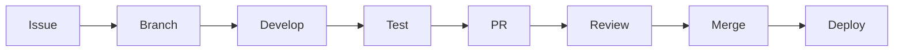
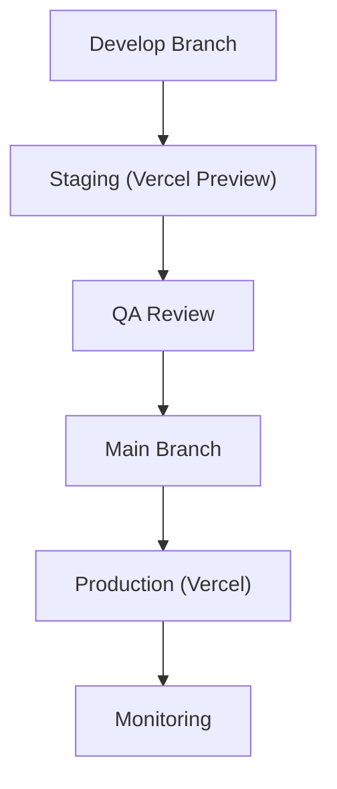

# Development Workflow — BUDI

> Standard development process for the BUDI project.

---

## 📋 Table of Contents

1. [Development Environment](#development-environment)
2. [Branch Strategy](#branch-strategy)
3. [Development Cycle](#development-cycle)
4. [Code Review Process](#code-review-process)
5. [Testing Strategy](#testing-strategy)
6. [Deployment Process](#deployment-process)
7. [Monitoring](#monitoring)

---

## Development Environment

### Prerequisites

| Tool | Version | Purpose |
|------|---------|---------|
| Node.js | >= 20.0.0 | JavaScript runtime |
| pnpm | >= 9.0.0 | Package manager |
| Supabase CLI | Latest | Database management |
| Git | Latest | Version control |

### Setup

```bash
# Clone & install
git clone https://github.com/your-org/budi.git
cd budi
pnpm install

# Environment
cp .env.example .env
# Edit .env with your Supabase credentials

# Start development
pnpm dev
```

### Available Commands

```bash
pnpm dev          # Start development servers
pnpm build        # Build all packages & apps
pnpm lint         # Lint all code
pnpm format       # Format all code
pnpm typecheck    # TypeScript type checking
pnpm test         # Run tests
pnpm clean        # Clean all caches & builds
```

## Branch Strategy

```
main              # Production-ready code
├── develop       # Integration branch
├── feat/*        # Feature branches
├── fix/*         # Bug fix branches
├── docs/*        # Documentation branches
└── chore/*       # Maintenance branches
```

### Naming Convention

```
feat/finance-transaction-export
fix/auth-token-refresh
docs/architecture-rls-diagram
chore/upgrade-tanstack-query
```

## Development Cycle



### 1. Issue Assignment

- All work starts from an issue
- Assign yourself to the issue
- Move to "In Progress" column

### 2. Branch Creation

```bash
git checkout develop
git pull origin develop
git checkout -b feat/your-feature-name
```

### 3. Development

- Follow [CODE_STYLE.md](../CODE_STYLE.md)
- Write tests for new functionality
- Update documentation
- Keep commits focused and atomic

### 4. Commit

Follow [Conventional Commits](https://www.conventionalcommits.org/):

```bash
git commit -m "feat(finance): add transaction export feature"
```

### 5. Pull Request

```bash
git push origin feat/your-feature-name
# Create PR via GitHub CLI or web interface
```

### 6. Code Review

See [Code Review Process](#code-review-process) below.

### 7. Merge

- Squash merge to `develop`
- Delete feature branch

## Code Review Process

### Reviewer Checklist

- [ ] Code follows [CODE_STYLE.md](../CODE_STYLE.md)
- [ ] Types are correct and strict
- [ ] Tests pass and cover edge cases
- [ ] No security vulnerabilities
- [ ] Performance considerations addressed
- [ ] Documentation updated
- [ ] Cross-references valid

### Review Rules

1. All PRs need at least **one approval**
2. PR author should not merge their own PR
3. Large PRs (>400 lines) should be split
4. Review within **24 hours** on business days

## Testing Strategy

### Test Pyramid (Future)

```
    ╱╲
   ╱ E2E ╲
  ╱────────╲
 ╱ Integration ╲
╱────────────────╲
╱   Unit Tests    ╲
╱──────────────────╲
```

- **Unit Tests** — Vitest for functions, hooks, utilities
- **Integration Tests** — React Testing Library for components
- **E2E Tests** — Playwright for critical user flows (future)

## Deployment Process



### Environments

| Environment | URL | Branch |
|-------------|-----|--------|
| Local | `localhost:5173` | Any |
| Staging | `staging.budi.app` | `develop` |
| Production | `budi.app` | `main` |

## Monitoring

- **Sentry** for error tracking
- **Supabase Dashboard** for database metrics
- **Vercel Analytics** for frontend performance
- **Console logs** only for development

---

## Related Documents

- [Architecture](architecture.md)
- [Contributing](../CONTRIBUTING.md)
- [Code Style](../CODE_STYLE.md)
- [Security](security.md)

