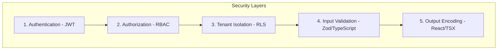
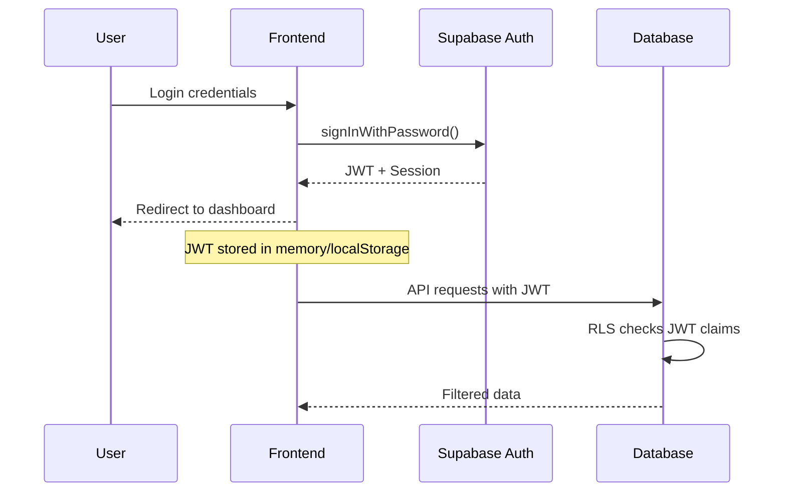
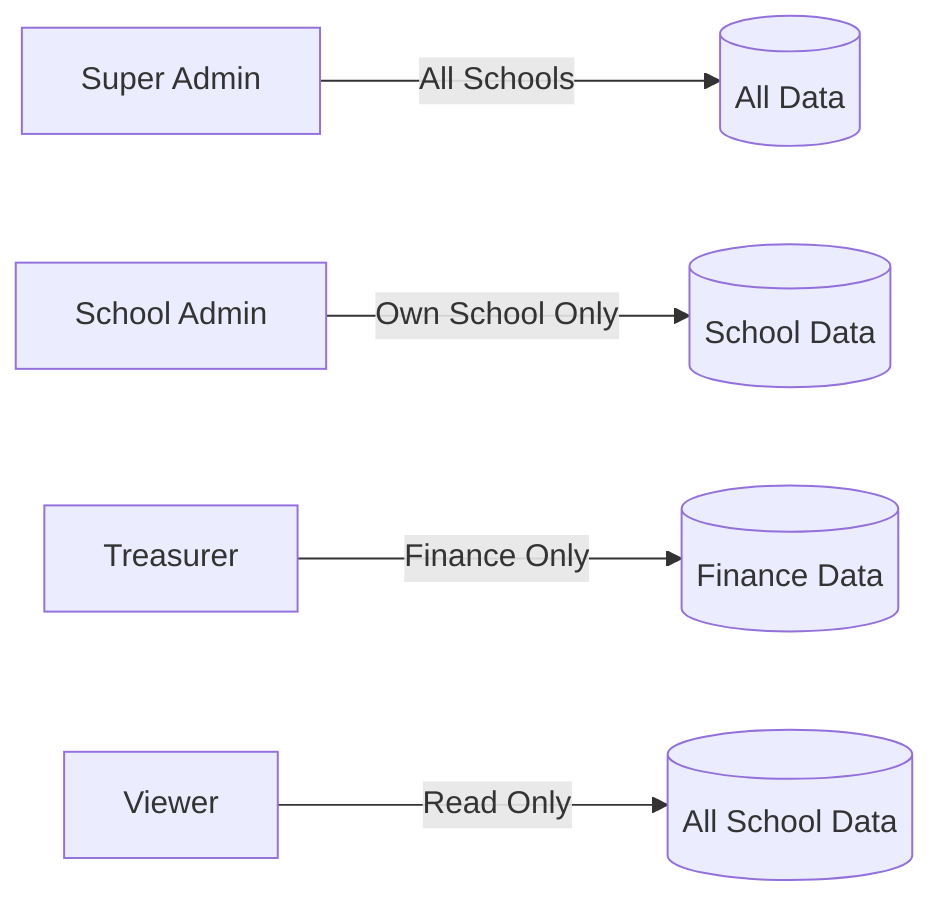

# Security — BUDI

> Security model, threat analysis, and defense mechanisms for the BUDI platform.

---

## 📋 Table of Contents

1. [Security Principles](#security-principles)
2. [Multi-Tenant Security](#multi-tenant-security)
3. [Authentication](#authentication)
4. [Authorization](#authorization)
5. [Row Level Security (RLS)](#row-level-security-rls)
6. [Data Protection](#data-protection)
7. [API Security](#api-security)
8. [Frontend Security](#frontend-security)
9. [Incident Response](#incident-response)

---

## Security Principles

1. **Defense in Depth** — Multiple layers of security
2. **Least Privilege** — Minimum access required
3. **Zero Trust** — Verify every request
4. **Secure by Default** — Opt-in to security exceptions
5. **Fail Secure** — Default deny on errors

## Multi-Tenant Security



### Tenant Isolation

1. **`school_id`** in every business table
2. **RLS policies** enforce tenant isolation
3. **JWT contains `school_id`** claim
4. **Frontend context** passes `school_id` from auth state
5. **Never trusted** — RLS is the ultimate gatekeeper

## Authentication

Supabase Auth handles authentication:

- Email/password authentication
- Magic link (future)
- OAuth providers (future): Google, Microsoft
- JWT-based sessions
- Secure HTTP-only cookies

### Auth Flow



## Authorization

### Role-Based Access Control (RBAC)

| Role | Database | Description |
|------|----------|-------------|
| `super_admin` | `user_profiles.role` | System-wide access |
| `school_admin` | `user_profiles.role` | School-level management |
| `treasurer` | `user_profiles.role` | Finance operations |
| `viewer` | `user_profiles.role` | Read-only access |

### Permission Matrix



## Row Level Security (RLS)

### Policy Pattern

```sql
-- Tenant isolation policy
CREATE POLICY "tenant_isolation" ON finance_transactions
    FOR ALL
    USING (school_id = auth.current_school_id());
```

### RLS Strategy

1. **Default deny** — All tables have RLS enabled
2. **Per-operation policies** — SELECT, INSERT, UPDATE, DELETE
3. **Role-based policies** — Different rules per role
4. **Helper functions** — `auth.current_school_id()`, `auth.user_role()`

## Data Protection

### At Rest

- PostgreSQL encryption at rest (managed by Supabase)
- RLS policies prevent unauthorized access
- No sensitive data in JWT tokens
- Audit logs for data access

### In Transit

- HTTPS/TLS for all communications
- Supabase enforces TLS 1.3
- API keys never transmitted in URL parameters

### Application Level

- XSS prevention via React's auto-escaping
- CSRF protection via Supabase's cookie-based auth
- SQL injection prevention via parameterized queries
- No raw SQL in frontend

## API Security

1. **Supabase API key** required for all requests
2. **RLS policies** enforce authorization
3. **Rate limiting** (Supabase handles)
4. **CORS configuration** for known origins
5. **No sensitive data** in error messages

## Frontend Security

1. **Environment variables** for secrets (`.env`)
2. **Never expose service role key** in frontend
3. **Input validation** before sending to API
4. **Content Security Policy** headers (future)
5. **Secure session storage** practices

## Incident Response

1. **Monitoring** via Sentry for errors
2. **Audit logging** for sensitive operations
3. **Supabase logs** for database access
4. **Rollback plan** for failed deployments
5. **Security patch workflow** via CONTRIBUTING.md

---

## Related Documents

- [Architecture](architecture.md)
- [Database Schema](database.md)
- [API Guidelines](api-guideline.md)
- [Development Workflow](development-workflow.md)

