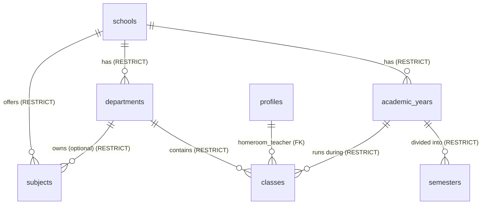

# Sprint 7 Architecture Decision: School Management Foundation

## 1. Final Module Boundaries
- **schools**: Manages the tenant-level settings and the core organizational structure (Academic Years, Semesters, Departments, Classes, and Subjects). This module acts as the foundational structural registry upon which other modules depend.
- **academic (future)**: Handles active educational operations including curriculum planning, grading, report cards, lesson plans, and daily student attendance.
- **finance**: Handles billing, tuition fees, transactions, accounting, and cash management.
- **users**: Manages global profiles, authentication, authorization (roles), and school enrollment (`school_users`).

## 2. Final RBAC Matrix
Row Level Security (RLS) policies for Sprint 7 tables will enforce the following access control:

| Role | Read | Write |
| :--- | :--- | :--- |
| **Super Admin** | Yes | Yes |
| **School Admin** | Yes | Yes |
| **Teacher** | Yes | No |
| **Staff** | Yes | No |
| **Student** | No | No |
| **Parent** | No | No |

**Reasoning for Student/Parent Restriction:** 
Sprint 7 introduces administrative master data only. Student and Parent portals do not exist yet. Exposing this foundational data directly to student/parent roles before their specific contextual UIs and privacy filters are built introduces unnecessary attack surface. Their read permissions will be strategically introduced in future sprints (Sprints 14/15).

## 3. Database ERD


## 4. Foreign Key Strategy
**Strategy:** `ON DELETE RESTRICT` for all structural data relationships.

**Reasoning:** The BUDI platform utilizes a strict soft-delete architecture (`deleted_at`). Using `ON DELETE CASCADE` at the database level physically deletes rows, permanently destroying historical academic data and violating the soft-delete principle. By utilizing `ON DELETE RESTRICT`, we prevent accidental hard deletion of parent entities (e.g., trying to hard delete a department that still has active or soft-deleted classes associated with it). Application logic must manually manage soft deletes of child records if a parent is soft deleted.

## 5. Database Design & Business Rules

### 1. `academic_years`
- **Purpose:** Represents a distinct academic calendar cycle (e.g., "2025/2026").
- **Relationships:** Belongs to `schools` (`school_id`).
- **Indexes:** `idx_academic_years_school`, `idx_academic_years_active`
- **Unique Constraints:** `UNIQUE(school_id, name) WHERE deleted_at IS NULL`
- **Business Rules:** **Only ONE Academic Year may be active per school.** This must be enforced via an explicit database trigger or partial unique index (`UNIQUE(school_id) WHERE is_active = true`).
- **RLS Behavior:** Isolated to `school_id = current_school_id()`. Editable by `school_admin` and `super_admin`.

### 2. `semesters`
- **Purpose:** Represents subdivisions of an academic year (e.g., "Odd", "Even").
- **Relationships:** Belongs to `academic_years` (`academic_year_id`) and `schools` (`school_id`).
- **Indexes:** `idx_semesters_academic_year`
- **Unique Constraints:** `UNIQUE(academic_year_id, name) WHERE deleted_at IS NULL`
- **Business Rules:** **Only ONE Semester may be active within an Academic Year.** Enforced via database trigger or partial unique index.
- **RLS Behavior:** Tenant isolation. Editable by `school_admin` and `super_admin`.

### 3. `departments`
- **Purpose:** Represents educational stages or organizational units (e.g., "SMP", "SMA", "Science Faculty").
- **Relationships:** Belongs to `schools`.
- **Indexes:** `idx_departments_school`
- **Unique Constraints:** `UNIQUE(school_id, code) WHERE deleted_at IS NULL`
- **Business Rules:** Used to group classes and subjects for billing and grading purposes.
- **RLS Behavior:** Tenant isolation. Editable by `school_admin` and `super_admin`.

### 4. `classes`
- **Purpose:** Represents physical or virtual student groupings.
- **Extended Fields:** 
  - `code`: System-friendly identifier.
  - `status`: Active, Inactive, Archived. Needed for tracking historical classes.
  - `description`: Internal notes.
  - `sort_order`: UI custom sorting.
- **Relationships:** Belongs to `schools`, `departments`, `academic_years`.
- **Indexes:** `idx_classes_school`, `idx_classes_department`, `idx_classes_academic_year`
- **Unique Constraints:** `UNIQUE(school_id, academic_year_id, code) WHERE deleted_at IS NULL`
- **Business Rules:** Must be bound to a specific academic year to prevent infinite enrollment.
- **RLS Behavior:** Tenant isolation. Editable by `school_admin` and `super_admin`.

### 5. `subjects`
- **Purpose:** Represents course offerings.
- **Extended Fields:** `is_active` (Allows schools to retire curriculum offerings without deleting historical grading data).
- **Relationships:** Belongs to `schools`, optionally `departments`.
- **Indexes:** `idx_subjects_school`
- **Unique Constraints:** `UNIQUE(school_id, code) WHERE deleted_at IS NULL`
- **Business Rules:** Subject definitions transcend academic years, but their active status determines if they can be scheduled in the current year.
- **RLS Behavior:** Tenant isolation. Editable by `school_admin` and `super_admin`.

## 6. Architecture Decisions (Design Rationale)

- **Why Schools owns Academic Years:** Multi-tenant architecture dictates that every school has its own custom academic calendar. A centralized global calendar would fail for schools in different hemispheres or with varying curricular structures.
- **Why Academic module is deferred:** Attempting to build grading and scheduling before the core master data exists leads to brittle relationships. Establishing robust master data (Sprint 7) allows the transactional modules to be built safely later.
- **Why Repository is separated per aggregate:** Keeping `useClassRepository` separate from `useAcademicYearRepository` enforces single responsibility, keeps TanStack Query cache keys isolated, and prevents mega-files.
- **Why Student/Parent access is postponed:** Administrative structures often contain internal codes and inactive draft records. Presenting these to parents without contextual filtering causes confusion.
- **Why soft-delete is preferred:** Academic data is heavily audited. Hard deleting a class would orphan financial billing records or historical grades, violating compliance.
- **Why RESTRICT is safer than CASCADE:** CASCADE bypasses application-level soft-delete logic and physically drops rows. RESTRICT acts as a database-level safety net, forcing the application to handle dependency resolution explicitly.

## 7. Future Compatibility

Sprint 7 intentionally lays the groundwork for the platform's long-term roadmap:

- **Sprint 8 (Student Enrollment):** Students will be assigned to a specific `classes.id` which guarantees they are bound to a specific `academic_year_id`.
- **Sprint 9 (Finance):** Tuition fees can be accurately billed based on a student's `departments.id` (e.g., SMA costs more than SMP) and bound to `academic_years.id`.
- **Sprint 10 (Scheduling):** A timetable can securely map a `subjects.id` to a `classes.id` within an active `semesters.id`.
- **Sprint 11 (Attendance):** Daily attendance logs will strictly reference the `classes.id` and `academic_years.id`.
- **Sprint 12 (Grading):** Report cards will calculate aggregates by joining `subjects.id` across `semesters.id`.
- **Sprint 13 (Report Cards):** Generation relies entirely on the hierarchical grouping of `academic_years` -> `semesters` -> `classes` -> `subjects`.
- **Sprint 14 (Parent Portal):** Parents will query their child's data filtered explicitly by the active `academic_years` and `semesters`.
- **Sprint 15 (Student Portal):** Students will securely access their own enrolled `classes.id` and current `semesters.id` data.

## 8. Risk Analysis

- **Data Growth:** Over a decade, active tables like `classes` and `subjects` will grow significantly per school.
  - *Mitigation:* Ensure UI components always filter by `academic_year_id` and `is_active` to limit payload size.
- **Migration Complexity:** Introducing 5 highly relational tables in one sprint requires meticulous ordering of foreign keys.
  - *Mitigation:* `010` migration must create tables in exact topological order: `academic_years` -> `semesters` -> `departments` -> `classes` / `subjects`.
- **Permission Drift:** As new roles (e.g., Counselor, Librarian) are added, ensuring they receive the correct read/write access to these foundational tables could be missed.
  - *Mitigation:* Maintain RLS policies dynamically via robust automated testing against all role enums.
- **Performance:** Extensive joins (e.g., `Class` -> `Department` -> `Academic Year` -> `School`) for deeply nested UI views could cause latency.
  - *Mitigation:* Utilize Supabase materialized views or heavily indexed FKs (`school_id` on every table) to bypass intermediate joins when querying tenant data.
- **Future Schema Evolution:** As national curriculums change, the definitions of `departments` and `classes` might require arbitrary metadata.
  - *Mitigation:* Consider adding an extensible `metadata JSONB` column to these foundational tables in the future if requirements outgrow the strict relational schema.

## 9. Repository & Route Structure
**Repositories:**
- `useAcademicYearRepository.ts`
- `useDepartmentRepository.ts`
- `useClassRepository.ts`
- `useSubjectRepository.ts`

**Routes:**
- `/manage/academic-years`
- `/manage/departments`
- `/manage/classes`
- `/manage/subjects`

## 10. UI Hierarchy
```text
Sidebar (School Admin View)
 └── School Settings
      ├── Academic Years (Manages years & active terms)
      ├── Departments (Manages educational units)
      ├── Classes (Manages rooms, status, and grade levels)
      └── Subjects (Manages active/retired course offerings)
```
