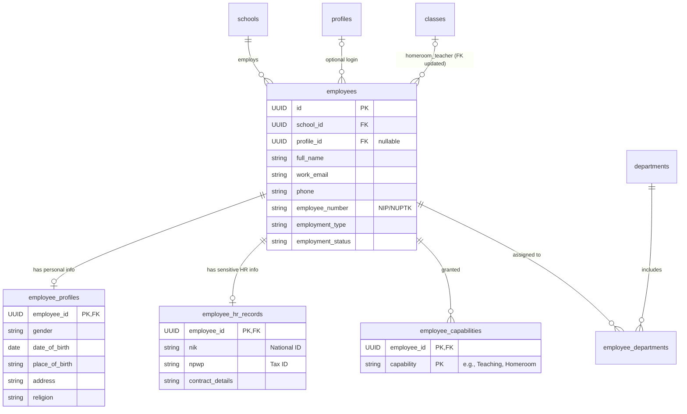

# Sprint 9 Architecture: Teachers & Staff Management

## 1. Existing-System Findings

A review of the existing BUDI platform (Migrations 001–011) yields the following architectural insights:
- **Identity vs. Domain**: The `profiles` and `school_users` tables firmly couple users to an authentication identity. The `students` module (Migration 011) successfully introduced a pattern where a domain entity exists independently of authentication, linking optionally via `profile_id`.
- **Existing Dependencies**: Migration `010` created the `classes` table with `homeroom_teacher_id UUID REFERENCES profiles(id)`. This directly couples homeroom teachers to auth accounts, violating the requirement that employees do not require a login. This foreign key must be safely migrated in Sprint 9.
- **Constraints**: The platform enforces strict `ON DELETE RESTRICT` for foreign keys and relies entirely on soft deletes (`deleted_at`) for accidental deletion recovery.

## 2. Recommended Employee Modeling Decision

**Decision**: A **Unified `employees` Master Identity** with a normalized **`employee_capabilities`** model.

**Employee Master Identity**:
- The `employees` table serves as the definitive HR master record. It operates completely independently of authentication.
- It owns the core identity fields: `full_name` (required), `work_email` (nullable), and `phone` (nullable).
- The `profile_id` remains a nullable link to `auth.users` / `profiles`. We **do not** rely on `profiles.full_name` for employee naming.

**Employee Capabilities**:
- Instead of a rigid `is_teaching_staff` boolean, we will use a dedicated `employee_capabilities` table (`employee_id`, `capability`).
- *Trade-offs*: While slightly more complex to query than a boolean, a normalized capability table is highly extensible. It seamlessly supports future granular capabilities (e.g., `Teaching`, `Homeroom Eligibility`, `Counseling`, `Department Leadership`, `Administration`) without requiring schema alterations for every new capability.

## 3. Domain Model & ERD

## 4. Table Definitions

1. **`employees`** (Directory / Master Record)
   - `id`, `school_id`
   - `profile_id` (nullable, maps to `profiles(id)`)
   - `full_name`, `work_email`, `phone`
   - `employee_number` (VARCHAR, unique per school)
   - `employment_type` (e.g., 'Full-time', 'Contract', 'Honorary')
   - `employment_status` (e.g., 'Active', 'Suspended', 'Resigned', 'Archived')
   - `join_date`, `exit_date`
2. **`employee_capabilities`** (Capabilities)
   - `employee_id` (FK to `employees`)
   - `capability` (VARCHAR, e.g., 'Teaching', 'Homeroom')
   - Primary Key: `(employee_id, capability)`
3. **`employee_profiles`** (Personal Demographics)
   - `employee_id` (PK, FK to `employees`)
   - `gender`, `place_of_birth`, `date_of_birth`, `address`, `religion`
4. **`employee_hr_records`** (Sensitive HR Data)
   - `employee_id` (PK, FK to `employees`)
   - `nik`, `npwp`, salary/contract info
5. **`employee_departments`** (Department Mapping)
   - `employee_id`, `department_id`, `is_head_of_department`

## 5. Employee Lifecycle & State Machine

**Status Definitions**:
- **Prospective**: Hired, but `join_date` is in the future.
- **Active**: Currently employed and working.
- **On Leave**: Temporarily inactive, retains employment.
- **Suspended**: Disciplinary pause.
- **Resigned**: Voluntarily left.
- **Retired**: Reached retirement age.
- **Terminated**: Involuntarily left.
- **Archived**: A strict *business lifecycle status* indicating the record is historically preserved but structurally hidden from active operational views.

**Distinction from `deleted_at`**:
- `Archived` is a business state. The record is valid and participates in historical queries (e.g., past gradebooks).
- `deleted_at` (soft-delete) is an *application visibility state* used strictly for recovering from accidental erroneous data entry. It is never used to represent a business termination or archive.

## 6. Privacy & Data Exposure Strategy

Data is strictly classified into three tiers to prevent exposure:

1. **Directory / Public-within-school (`employees`, `employee_capabilities`, `employee_departments`)**:
   - Contains `full_name`, `work_email`, `phone`, capabilities, and status.
   - **Access**: Visible to all `authenticated` users within the tenant.
2. **Personal (`employee_profiles`)**:
   - Contains `gender`, `date_of_birth`, `address`, `religion`.
   - **Access**: Visible to `school_admin`, `super_admin`, and the employee themselves (`auth.uid() = employees.profile_id`).
3. **HR-Sensitive (`employee_hr_records`)**:
   - Contains `nik`, `npwp`, and contractual details.
   - **Access**: Visible ONLY to `school_admin` and `super_admin`. Employees *cannot* view their own HR-sensitive fields simply because their `profile_id` matches.

## 7. Department Assignment Constraints

The `employee_departments` many-to-many relationship enforces the following constraints:
- **Duplicate Assignments**: `UNIQUE (employee_id, department_id)` where `deleted_at IS NULL`.
- **Head of Department Uniqueness**: `UNIQUE (department_id)` where `is_head_of_department = true` and `deleted_at IS NULL`. (Only one head per department).
- **Multiple Heads**: One employee *may* head multiple departments (no unique constraint on `employee_id` where `is_head = true`).

## 8. Migration 012 Plan & Pre-Flight Checklist

Before applying Migration 012, we must ensure existing data in the `classes` table is safely migrated from referencing `profiles(id)` to `employees(id)`.

**Pre-Flight Migration Strategy**:
1. **Analyze Existing Data**: Scan `classes.homeroom_teacher_id` for non-null values. Scan `profiles` for users representing staff.
2. **Employee Backfill**: For every distinct `homeroom_teacher_id` currently in `classes`, the migration script must auto-generate a stub `employees` record using data joined from `profiles` (mapping `profiles.full_name` to `employees.full_name`, and `profiles.id` to `employees.profile_id`). 
3. **Capability Backfill**: Grant the `Homeroom` capability to these newly generated employee records.
4. **FK Migration Ordering**:
   - Step A: Add new column `homeroom_employee_id UUID REFERENCES employees(id) ON DELETE RESTRICT`.
   - Step B: Execute the backfill data migration script, copying the newly generated employee UUIDs into `homeroom_employee_id`.
   - Step C: Drop the old column `homeroom_teacher_id`.
   - Step D: Rename `homeroom_employee_id` to `homeroom_teacher_id`.
   *(This ensures we do NOT silently reinterpret existing UUID values).*

**Pre-Flight Checklist**:
- [ ] Determine if `classes` table contains actual production `homeroom_teacher_id` data.
- [ ] Write and test the PL/pgSQL block to dynamically backfill `employees` from `profiles`.
- [ ] Verify `employee_hr_records` RLS strictly denies self-read access.
- [ ] Prepare rollback strategy: If FK mapping fails, the migration transaction will automatically rollback. Forward-fixes are preferred post-commit.

## 9. RBAC Matrix

| Action | Super Admin | School Admin | Staff | Teacher |
| :--- | :---: | :---: | :---: | :---: |
| View Directory (`employees`) | ✅ | ✅ | ✅ | ✅ |
| View Personal (`employee_profiles`) | ✅ | ✅ | ❌ | Self Only |
| View HR Sensitive (`employee_hr_records`) | ✅ | ✅ | ❌ | ❌ |
| Create / Edit Employee | ✅ | ✅ | ❌ | ❌ |
| Change Employment Status | ✅ | ✅ | ❌ | ❌ |

## 10. Proposed Sprint 9 Phases

- **Phase 1**: Database Migration (012), Data Backfill, & Class FK Refactoring
- **Phase 2**: Services, Repositories, and Supabase Type Regeneration
- **Phase 3**: UI Pages, Components, and Forms
- **Phase 4**: Router Integration, Sidebar, and Release Candidate Validation
